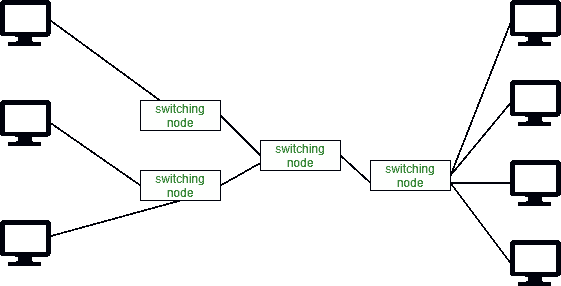
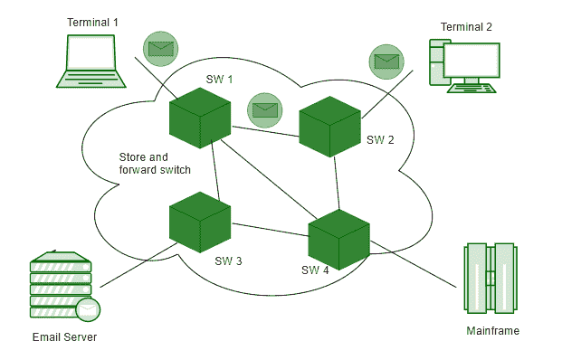

# 电路切换和消息切换的区别

> 原文:[https://www . geesforgeks . org/电路交换和消息交换的区别/](https://www.geeksforgeeks.org/difference-between-circuit-switching-and-message-switching/)

先决条件–[计算机网络|交换技术](https://www.geeksforgeeks.org/computer-network-switching-techniques-message-switching/)
**电路交换**和**消息交换**都是用于将不同设备相互连接的方法。电路交换和消息交换的主要区别在于，电路交换是通过在两个系统之间设置物理路径来完成的，而消息交换是通过**存储**和**转发**方法来完成的。

电路切换

消息交换

在消息交换中，数据首先由一个节点存储，然后转发到另一个节点，以将数据传输到另一个系统。

**电路交换和报文交换的区别:**

<figure class="table">

| S.NO | 电路切换 | 信息交换 |
| 1. | 电路交换是通过在两个系统之间设置物理路径来完成的。 | 在消息交换中，数据首先由一个节点存储，然后转发到另一个节点，以将数据传输到另一个系统。 |
| 2. | 在电路交换中，不存储数据。 | 在消息交换中，数据首先被存储，然后被转发到下一个节点。 |
| 3. | 电路交换需要专用的物理路径，这就是为什么消息不需要被寻址。 | 消息交换不需要专用的物理路径，在消息交换中，消息是独立寻址的。 |
| 4. | 电路交换是**地理寻址**。 | 消息交换是**分层寻址**。 |
| 5. | 电路交换比消息交换更昂贵。 | 消息交换的成本低于电路交换。 |
| 6. | 电路交换路由是手动类型路由。 | 消息交换路由不是手动类型路由，这里路由是在呼叫建立期间选择的。 |
| 7. | 电路交换提前预留全部带宽。因此，存在大量带宽浪费 | 消息交换不会提前预留整个带宽。这就是带宽被最大限度利用的原因。 |
| 8. | 在线开关中，电荷取决于时间和距离。 | 在信息交换中，费用是根据字节数和距离计算的。 |
| 9. | 电路交换中每分钟都会发生拥塞。 | 在消息交换中，不发生拥塞或发生很少拥塞。 |
| 10. | 电路交换在各种平台上使用模拟和数字媒体。 | 而消息交换在各种平台上使用数字媒体。 |
| 11. | 电路内切换没有传播延迟。 | 在消息交换中，存在传播延迟。 |
| 12. | 电路交换的传输容量很低。 | 而消息交换的传输容量高。 |

</figure>