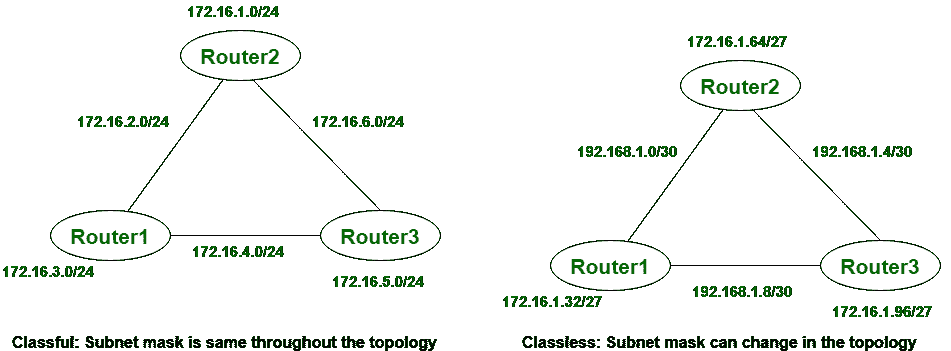

# 有类路由和无类路由的区别

> 原文:[https://www . geesforgeks . org/有类路由和无类路由的区别/](https://www.geeksforgeeks.org/difference-between-classful-routing-and-classless-routing/)

**有类路由:**
有类路由不导入子网掩码。在这种情况下，子网掩码也在路由更新后提供。在有类路由中，子网掩码始终相同，不会因所有设备而异，我们可以在给定的图片中看到。在有类路由中，不支持 [VLMS(可变长度子网掩码)](https://www.geeksforgeeks.org/computer-network-introduction-to-variable-length-subnet-mask-vlsm/)以及 [CIDR(无类域间路由)](https://www.geeksforgeeks.org/computer-network-classless-inter-domain-routing-cidr/)。

**无类路由:**
无类路由导入子网掩码，在这种情况下，使用触发更新。在无类路由中，支持 VLMS(可变长度子网掩码)和 CIDR(无类域间路由)。在无类路由中，hello 消息用于检查状态。在无类路由中，子网掩码并不完全相同，它可能因所有设备而异，我们可以在给定的图片中看到。

让我们看看有类路由和无类路由之间的区别:

| S.NO | 有类路由 | 无类路由 |
| --- | --- | --- |
| 1. | 在有类路由中，不支持 VLMS(可变长度子网掩码)。 | 在无类路由中，支持 VLMS(可变长度子网掩码)。 |
| 2. | 有类路由需要更多带宽。 | 而它需要更少的带宽。 |
| 3. | 在有类路由中，不使用 hello 消息。 | 在无类路由中，使用 hello 消息。 |
| 4. | 有类路由不导入子网掩码。 | 而它导入子网掩码。 |
| 5. | 在有类路由中，地址分为三部分:网络、子网和主机。 | 而在无类路由中，地址分为两部分:子网和主机。 |
| 6. | 在有类路由中，使用定期更新。 | 而在这种情况下，使用触发更新。 |
| 7. | 在有类路由中，不支持 CIDR(无类域间路由)。 | 在无类路由中，支持 CIDR(无类域间路由)。 |
| 8. | 在有类路由中，子网不显示在其他主要子网中。 | 在无类路由中，子网显示在其他主要子网中.. |
| 9. | 在有类路由中，故障很容易被发现。 | 而在无类路由中，故障检测并不困难。 |