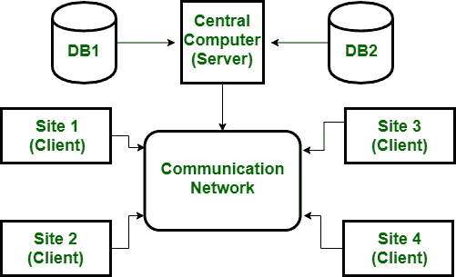

# 客户端/服务器和分布式数据库管理系统的区别

> 原文:[https://www . geesforgeks . org/客户机-服务器-分布式数据库管理系统之间的区别/](https://www.geeksforgeeks.org/difference-between-client-server-and-distributed-dbms/)

**1。客户端/服务器:**
客户端/服务器是为了应对各种计算机和服务器通过网络连接在一起的计算环境而开发的。在这种体系结构中，客户机是提供用户界面和本地处理能力的用户机器。当任何客户端需要额外的功能(如数据库访问)时，它可以连接到能够提供客户端所需功能的服务器。基本上，服务器是一台向客户端提供服务的机器，即用户机器。

**2。[分布式数据库管理系统](https://www.geeksforgeeks.org/distributed-database-system/):在分布式数据库管理系统中，数据分布在地理位置上。每个站点在其末端都是一个完整的数据库系统站点，但是不同的站点必须一起工作，因为如果任何用户想要访问数据，它可以在网络的任何地方轻松地访问数据，因为数据存储在用户自己的计算机上。**

**客户端/服务器与分布式数据库管理系统的区别:**

| 没有。 | 客户端/服务器 | 分布式数据库管理系统 |
| --- | --- | --- |
| 1. | 客户端一次只能访问一台服务器。 | 用户可以同时访问多个网站。 |
| 2. | 很难管理。 | 很容易管理。 |
| 3. | 在这种情况下，数据分布在客户端。 | 在这种情况下，数据分布在各个站点。 |
| 4. | 与分布式数据库管理系统相比，访问数据库的速度很慢。 | 访问数据库的速度比客户机/服务器架构好得多。 |
| 5. | 如果服务器崩溃，整个系统就会停止。 | 一个站点的崩溃不会停止整个系统。 |
| 6. | 数据访问很容易控制。 | 数据访问很难控制。 |
| 7. | 与分布式数据库管理系统相比，它更便宜。 | 它很贵。 |
| 8. | 维护成本低。 | 维护成本高。 |

