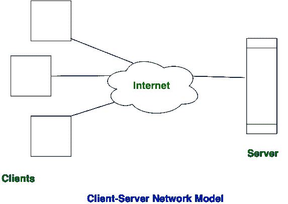
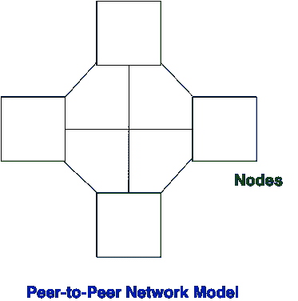

# 客户端-服务器和对等网络的区别

> 原文:[https://www . geesforgeks . org/客户端-服务器和对等网络之间的区别/](https://www.geeksforgeeks.org/difference-between-client-server-and-peer-to-peer-network/)

**客户端-服务器网络:**
该模型是广泛使用的网络模型。在客户机-服务器网络中，客户机和服务器是有区别的，存在特定的服务器和客户机。在客户机-服务器网络中，集中式服务器用于存储数据，因为它的管理是集中式的。在客户-服务器网络中，服务器响应客户的服务请求。

**对等网络:**
这个模型没有区分客户端和服务器，在这个模型中，每个节点本身就是客户端和服务器。在对等网络中，每个节点都可以请求和响应服务。

**客户端-服务器和对等网络的区别:**

| S.NO | 客户端-服务器网络 | 对等网络 |
| 1. | 在客户机-服务器网络中，客户机和服务器是有区别的，存在特定的服务器和客户机。 | 在对等网络中，客户端和服务器没有区别。 |
| 2. | 客户-服务器网络侧重于信息共享。 | 而对等网络侧重于连通性。 |
| 3. | 在客户机-服务器网络中，集中式服务器用于存储数据。 | 而在对等网络中，每个对等点都有自己的数据。 |
| 4. | 在客户-服务器网络中，服务器响应客户的服务请求。 | 在对等网络中，每个节点都可以请求和响应服务。 |
| 5. | 客户端-服务器网络比对等网络更昂贵。 | 而对等网络比客户机-服务器网络成本更低。 |
| 6. | 客户端-服务器网络比对等网络更稳定。 | 而对等网络如果对等体数量增加，则不太稳定。 |
| 7. | 客户端-服务器网络用于小型和大型网络。 | 而对等网络通常适用于少于 10 台计算机的小型网络。 |