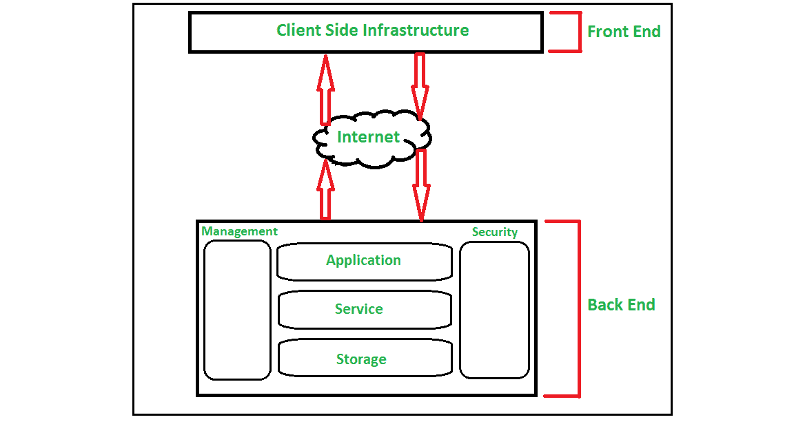
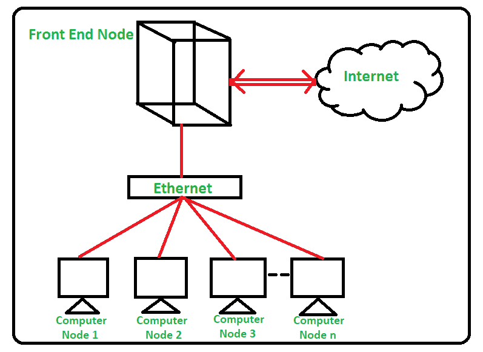

# 云计算与集群计算的区别

> 原文:[https://www . geeksforgeeks . org/云计算与集群计算的区别/](https://www.geeksforgeeks.org/difference-between-cloud-computing-and-cluster-computing/)

**1。云计算:**
云计算是指通过互联网按需交付信息技术资源，特别是计算能力和数据存储，并按使用付费。它通常是指用户通过互联网可以使用的数据中心。云计算是虚拟化的资源池。它允许我们在线创建、配置和定制我们的应用程序。用户可以随时随地访问任何资源，而无需担心实际资源的管理和维护。云计算通过网络提供基于硬件和软件的计算资源组合。

下图展示了云计算的简单架构–

**2。集群计算:**
集群计算是指将计算任务共享给集群的多台计算机的过程。网络上连接的计算机数量，它们通过形成计算机集群来执行单个任务，计算过程称为集群计算。

集群计算是一种高性能计算框架，它有助于以更快的处理速度和更好的数据完整性更高效地解决更复杂的操作。集群计算是一种基于分布式系统原理执行操作的网络技术。

下图展示了集群计算的简单体系结构–

**云计算与集群计算的区别:**

| **序列号** | **类别** | **云计算** | **集群计算** |
| 1. | 目标 | 提供按需信息技术资源和服务。 | 以模块化方式执行复杂的任务。 |
| 2. | 资源共享 | 特定分配的资源不可共享。 | 特定分配的资源不可共享。 |
| 3. | 资源类型 | 云计算中存在异构资源类型。 | 在集群计算中，存在同构资源类型。 |
| 4. | 虚拟化 | 虚拟化硬件和软件资源。 | 没有虚拟化资源。 |
| 5. | 安全 | 通过隔离可以实现安全。 | 通过节点凭证可以实现安全性。 |
| 6. | 最初成本 | 安装的初始资本成本非常低。 | 设置的初始资本成本非常高。 |
| 7. | 安全性要求 | 极低 | 非常高 |
| 8. | 维护 | 要求低维护。 | 几乎不需要更多的维护。 |
| 9. | 五金器具 | 物理上没有硬件要求。 | 物理上对硬件要求更高。 |
| 10. | node.js(节点. js) | 虚拟机中运行多个操作系统 | Windows、Linux |
| 11. | 用户管理 | 用户管理集中或分散到供应商/第三方。 | 用户管理是集中的。 |
| 12. | 可量测性 | 允许 | 有限的 |
| 13. | 体系结构 | 在云计算中，用户选择的架构。 | 集群计算中面向集群的体系结构 |
| 14. | 特性 | 动态计算基础设施/资源/服务 | 紧密耦合的系统/资源 |
| 15. | 依赖软件 | 云计算应用领域独立软件。 | 集群计算应用领域相关软件。 |
| 16. | 例子 | 邮箱，Gmail | 索尼 PlayStation 集群 |

