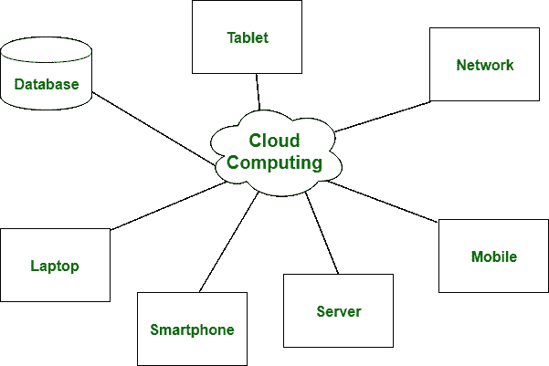
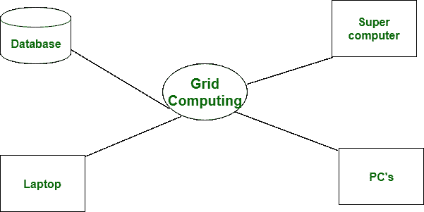

# 云计算与网格计算的区别

> 原文:[https://www . geeksforgeeks . org/云计算与网格计算的区别/](https://www.geeksforgeeks.org/difference-between-cloud-computing-and-grid-computing/)

**云计算:**
云计算是一种客户端-服务器计算架构。在云计算中，资源以集中的模式使用，云计算是一种高可访问性的服务。它是一种付费和使用的商业手段，在云计算中，用户为使用付费

**网格计算:**
网格计算是一种分布式计算架构。在网格计算中，资源以协作模式使用，同样在网格计算中，用户也不为使用付费。

让我们看看云计算和网格计算的区别，如下所示:

<figure class="table">

| S.NO | 

云计算

 | 

网格计算

 |
| --- | --- | --- |
| 1. | 云计算是一种客户端-服务器计算架构。 | 而它是一个分布式计算架构。 |
| 2. | 云计算是一个集中的执行机构。 | 而网格计算是一个分散的执行。 |
| 3. | 在云计算中，资源以集中的模式使用。 | 而在网格计算中，资源是以协作模式使用的。 |
| 4. | 它比网格计算更灵活。 | 虽然它不如云计算灵活。 |
| 5. | 在云计算中，用户为使用付费。 | 而在网格计算中，用户不付费使用。 |
| 6. | 云计算是一种高可及性的服务。 | 而网格计算是一种低可及性的服务。 |
| 7. | 与网格计算相比，它具有很高的可扩展性。 | 与云计算相比，网格计算的可扩展性较低。 |
| 8. | 它可以通过标准的网络协议访问。 | 而它可以通过网格中间件访问。 |

</figure>