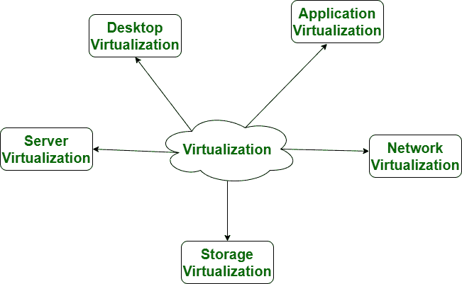

# 云计算与虚拟化的区别

> 原文:[https://www . geeksforgeeks . org/云计算与虚拟化的区别/](https://www.geeksforgeeks.org/difference-between-cloud-computing-and-virtualization/)

**1。云计算:**
云计算是一种客户端-服务器计算架构。在云计算中，资源以集中的模式使用，云计算是一种高可访问性的服务。云计算是一种支付和使用的商业工具，用户为使用付费。

**2。虚拟化:**
虚拟化就是云计算的建立。正是这种新鲜感，从某些古怪的条件或单一的物理设备框架中赋予了持续的资产时代。在这里，虚拟机管理程序的工作是必不可少的，它与设备合理地相关联，以便从中制造一些虚拟机。这些虚拟机的工作是明确无误的，独立的，不会互相干扰。在灾难恢复的情况下，它依赖于单个外围设备，因为单个专用硬件在这方面做得很好。

虚拟化存在于不同的类别中，它们是:-

我们来看看云计算和虚拟化的区别:-

| S.NO | 云计算 | 虚拟化 |
| --- | --- | --- |
| 1. | 云计算用于提供可按需访问的池和自动化资源。 | 而它用于通过物理硬件系统制造各种模拟环境。 |
| 2. | 云计算设置繁琐、复杂。 | 与云计算相比，虚拟化设置非常简单。 |
| 3. | 云计算是高度可扩展的。 | 与云计算相比，虚拟化的可扩展性较低。 |
| 4. | 云计算非常灵活。 | 而虚拟化不如云计算灵活。 |
| 5. | 在灾难恢复的情况下，云计算依赖于多台机器。 | 而它依赖于单个外围设备。 |
| 6. | 在云计算中，工作负载是无状态的。 | 在虚拟化中，工作负载是有状态的。 |
| 7. | 云计算的总成本高于虚拟化。 | 虚拟化的总成本低于虚拟化。 |
| 8. | 云计算需要很多专用硬件。 | 而单个专用硬件可以在这方面做得很好。 |
| 9. | 云计算提供了无限的存储空间。 | 而存储空间取决于虚拟化中的物理服务器容量。 |
| 10. | 云计算有两种类型:公有云和私有云。 | 虚拟化有两种类型:硬件虚拟化和应用程序虚拟化。 |