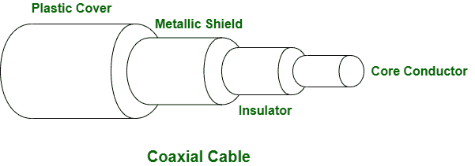
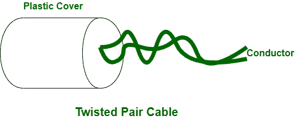

# 同轴电缆和双绞线电缆的区别

> 原文:[https://www . geesforgeks . org/同轴电缆和双绞线电缆的区别/](https://www.geeksforgeeks.org/difference-between-coaxial-cable-and-twisted-pair-cable/)

先决条件–[传输介质的类型](https://www.geeksforgeeks.org/types-transmission-media/)

**同轴电缆:**
同轴电缆是一类用于传输大频率信号的导向介质。同轴电缆由一根实心导体、三层绝缘层和一根接地导体组成。在同轴电缆中，内部实心导体有助于以电信号的形式传输信号。同轴电缆通常用于互联网连接、电视信号分配和无线电传输。

**双绞线电缆:**
双绞线电缆是一种导向介质，通过绞合两根电线来实现传输，从而形成电路。双绞线电缆由绝缘铜线组合而成。在双绞线电缆中，金属铜线有助于以电信号的形式传输信号。双绞线电缆主要用于电话网络和电缆屏蔽。

同轴电缆和双绞线电缆的区别如下:

<figure class="table">

| 没有。 | 同轴电缆 | 双绞线电缆 |
| --- | --- | --- |
| 1. | 在同轴电缆中，信号通过电缆的内导体传输。 | 在双绞线电缆中，信号通过金属导线传输。 |
| 2. | 速度高达 10 Mbps。 | 速度高达 10 Gbps。 |
| 3. | 同轴电缆很难安装和实施。 | 虽然双绞线电缆易于安装和实施。 |
| 4. | 与双绞线相比，同轴电缆具有最好的噪音防护。 | 在双绞线电缆中，抗扰度最低。 |
| 5. | 同轴电缆支持中等范围的带宽。 | 双绞线电缆支持低范围的带宽。 |
| 6. | 同轴电缆的应用包括互联网连接、电视信号分配和无线电传输等。 | 双绞线在电话网络和电缆屏蔽中的应用。 |
| 7. | 同轴电缆的成本相对昂贵。 | 与同轴电缆相比，双绞线电缆的成本更低。 |

</figure>