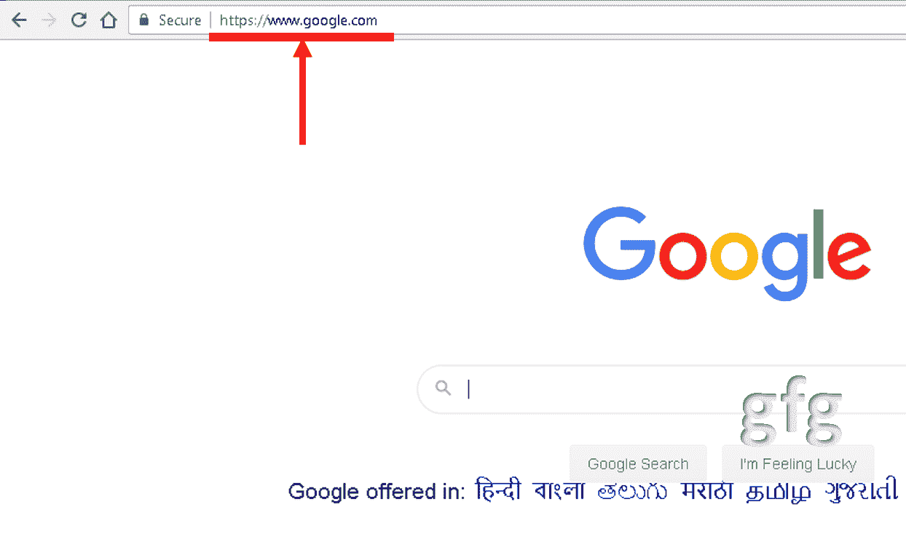
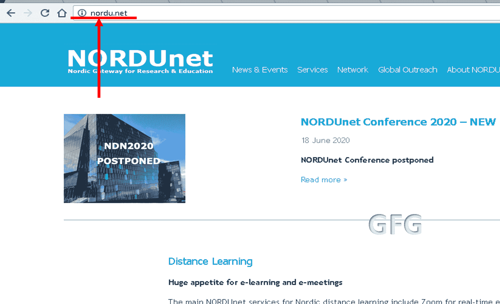

# 之间的区别。com 和。网域

> 原文:[https://www . geesforgeks . org/com 和 net-domain 的区别/](https://www.geeksforgeeks.org/difference-between-com-and-net-domain/)

**1。。**
互联网利用了*。com* [域名](https://www.geeksforgeeks.org/domain-name-server-dns-in-application-layer/)非常受欢迎。它非常受欢迎，在最新的键盘按键上也能看到。*。com* 是顶级域名。它是最早的通用域之一(与赞助域和受限域相对)。它基本上是为商业实体使用而引入的，但是，由于该域的非限制性性质，它可以被个人和非商业实体使用。*的价格。com* 域名由于受欢迎程度相当高。
如 www.google.com、www.bbn.com、www.think.com、www.mcc.com、www.dec.com、www.northrop.com、www.xerox.com。

**谷歌有一个*。com* 域**

**Source –** www.google.com

**2。。净域:**
*。net* 也是通用顶级域名的一种类型。它是 1985 年引入的首批域名之一(与*一起)。com* 和*。org* )。这种类型的域旨在由网络公司、数据库提供商、托管实体或互联网服务提供商或类似的此类实体使用。由于其不受限制的性质，现在所有类型的实体和个人都在使用它。*。净*域名定价低于*。com* 域名，因为它不太受欢迎。如今，在很多情况下，*。net* 域名被用来替代不可用的。com 域名。

www.behance.net、www.broken.net、www.nsf.net、www.nyser.net、www.uu.net、www.sesqui.net、www.mr.net、www.oar.net。

**Nordu.net 是 under.net 注册的第一个域名**

*来源:www.nordu.net*

**之间的区别。com 和。网域:**

| 没有。 | 。com | 。网 |
| --- | --- | --- |
| 1. | 用于通用和商业网站(由营利性实体使用)。 | 它由基于网络的公司或实体使用，如互联网服务提供商和类似的基础设施，由各种组织使用，或者当首选名称在。com 域已用尽。 |
| 2. | 。com 比. net 更受欢迎。 | 它没有. com 受欢迎。 |
| 3. | 注册由威瑞信处理。这些域名可以由其他注册服务商(例如谷歌、Go Daddy)处理，但是，它们最终与 Verisign 有合作关系或从属关系。 | 。净注册也由 Verisign 处理。 |
| 4. | 它比。net(由于的普及。com 域)。 | 它比……便宜。com(由于。网络不太受欢迎)。 |
| 5. | 这是一个顶级域名(TLD)。这是有史以来最早创建的域之一。它也是一个通用域。通用意味着它可以用于通用目的。 | 这是一个通用顶级域名(gTLD)。这是第一个为通用而创建的域之一。 |
| 6. | 它旨在供商业实体使用。 | 它被介绍给网络组织使用。 |
| 7. | 它来源于商业这个词。它是为商业实体设计的。 | 它来源于网络这个词。它是为互联网服务提供商等网络实体设计的。 |
| 8. | 注册网站是 www.verisign.com。 | 注册网站是 www.verisign.com，也就是类似的。因为两者都由同一个 unity Verisign 处理。 |
| 9. | 第一个在下注册的网站。com 域名是 www.symbolics.com。 | 第一个在下注册的网站。网域名称是 www.nordu.net。 | 10. | 例如:www.google.com、www.bbn.com、www.think.com、www.mcc.com、www.dec.com、www.northrop.com、www.xerox.com。 | 例如:www.behance.net。broken.net。nsf.net。nyser.net。www.sesqui.net uu.net。www.oar.net mr.net。 |

