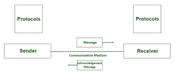
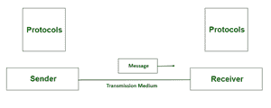

# 通信和传输的区别

> 原文:[https://www . geeksforgeeks . org/通信与传输的区别/](https://www.geeksforgeeks.org/difference-between-communication-and-transmission/)

**1。通信:**
通信是指双向通话，例如在网络中，计算机相互通话以将数据从一台计算机传输到另一台计算机。沟通也可以是一个站同时和多个站通话，或者你可以让多个站同时和多个站通话。

*例如*，通过 Wi-Fi 连接连接到互联网的计算机通过使用无线介质从多个远程服务器发送和接收数据来参与数据通信。计算机连接到路由器并询问其 IP 地址。路由器以计算机的本地 IP 地址作为响应，并将其连接到互联网。然后计算机请求访问某个服务器进行通信，TCP/IP 数据包通过多个路由器，直到到达目的服务器。服务器通过遵循相同的步骤返回一条消息给计算机。

**2。传输:**
传输只是一种通信方式，就是电脑只能说出来，不能接收任何东西。传输将是通信的一半，您将向网络发送数据包，然后通信的另一半将使用接收器在数据包返回时接受它。嗯，你使用传输的计算机是一个软件电台，你只在那里传输和接收输入。

*例如*，随机存取存储器(RAM)或硬盘通过向处理器发送数据来执行数据传输。数据总线用于将数据从内存或硬盘传输到中央处理器。数据总线是双向的，也就是说，它可以在两个方向上传输数据——从内存到中央处理器，反之亦然，但它一次只能在一个方向上传输数据。从内存到中央处理器的数据传输是由数据总线执行的单向过程。

**通信和传输的区别:**

<figure class="table">

| **变速器** | **沟通** |
| 传播是将任何东西从一个地方转移到另一个地方的行为，例如广播或电视广播或疾病从一个人转移到另一个人。 | 以可理解的方式将信息从发送者传递到接收者的过程称为通信。 |
| 传输是信息的物理运动，涉及诸如比特极性、同步、时钟等问题。 | 通信是指两种通信媒介之间的信息充分交换。 |
| 传输是一种单向数据传输。 | 沟通是一个双向互动的过程，所有参与者都积极分享他们的数据。 |
| 传输是指将数据从源传输到目的地。 | 通信是使用外部连接的数据线发送和接收数据的过程。 |
| 传输是指将一些信息或数据从一个地方发送到另一个地方，但只是传输，而在接收端，我们无法确定它是否被接收到。 | 通信意味着双向通信，例如，如果您发送任何必须在接收端接收的信息或数据。 |
| 在传输中，我们只是将数据传输到目的地。源头和目的地之间没有对话。 | 在交流中，源和目的地之间会有对话。 |
| **例如:**当某物通过电缆线到达目的地时。 | 例如，杂货店的一组主管都是同一级别的。在这个网络中，他们将相互连接，然后将信息传递给助理经理，助理经理随后将信息传递给收银员。 |

</figure>