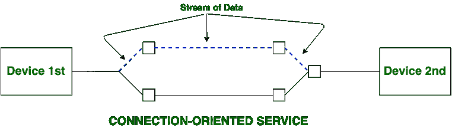
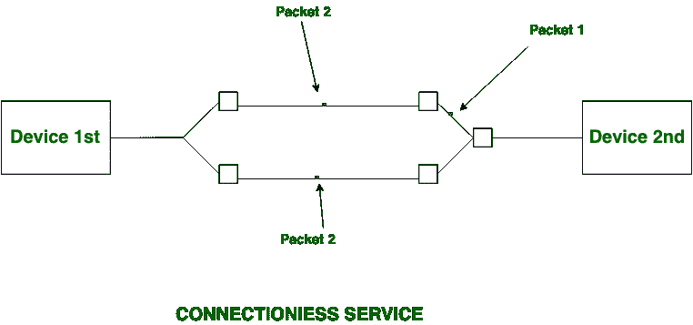

# 面向连接和无连接服务的区别

> 原文:[https://www . geesforgeks . org/面向连接和无连接服务之间的区别/](https://www.geeksforgeeks.org/difference-between-connection-oriented-and-connection-less-services/)

面向连接的服务[和无连接服务](https://practice.geeksforgeeks.org/problems/what-is-connection-oriented-and-connection-less-transmission-in-transport-layer)都用于两个或两个以上设备之间的连接建立。这些类型的服务由网络层提供。

**面向连接的服务**与电话系统有关。它包括连接建立和连接终止。在面向连接的服务中，握手方法用于建立发送方和接收方之间的连接。

**无连接服务**与邮政系统有关。它不包括任何连接建立和连接终止。无连接服务不能保证可靠性。在这种情况下，数据包不会遵循相同的路径到达目的地。

**面向连接和无连接服务的区别:**

| S.NO | 面向连接的服务 | 无连接服务 |
| 1. | 面向连接的服务与电话系统有关。 | 无连接服务与邮政系统有关。 |
| 2. | 面向连接的服务是长期稳定通信的首选。 | 突发通信更喜欢无连接服务。 |
| 3. | 面向连接的服务是必要的。 | 无连接服务不是强制性的。 |
| 4. | 面向连接的服务是可行的。 | 无连接服务不可行。 |
| 5. | 在面向连接的服务中，拥塞是不可能的。 | 在无连接服务中，拥塞是可能的。 |
| 6. | 面向连接的服务保证了可靠性。 | 无连接服务不能保证可靠性。 |
| 7. | 在面向连接的服务中，数据包遵循相同的路由。 | 在无连接服务中，数据包不遵循相同的路由。 |
| 8. | 面向连接的服务需要高范围的带宽。 | 无连接服务需要低范围的带宽。 |