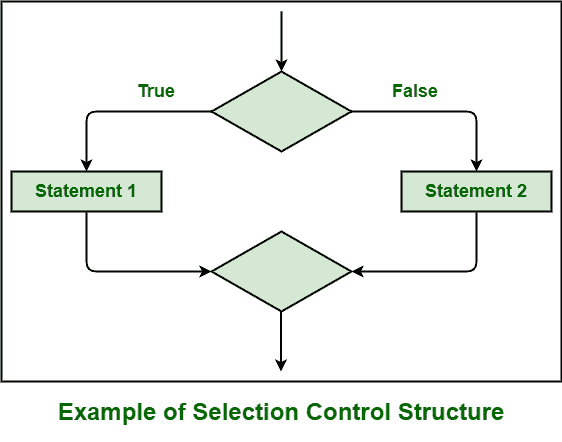
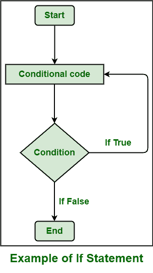

# 控制结构和控制语句的区别

> 原文:[https://www . geesforgeks . org/控制结构与控制语句的区别/](https://www.geeksforgeeks.org/difference-between-control-structure-and-control-statement/)

**1。** [**控制结构**](https://www.geeksforgeeks.org/control-structures-in-programming-languages/) **:**
控制结构，顾名思义，基本上就是一组控制其执行的语句和控制语句。

**2。控制语句:**
控制语句，顾名思义，基本上就是用来确定一组语句的控制流的语句。它根据陈述提供的条件或根据价值和逻辑做出决定。

**控制结构与控制语句的区别:**

<figure class="table">

| **控制结构** | **控制声明** |
| 其主要目的是适应设定值的变化并抑制网络中的负载扰动。 | 它的主要目的是确定或识别语句是否会被执行。 |
| 它有助于改变程序流程，允许我们从更简单的构建块中开发复杂的指令集，等等。 | 它有助于决策、持续执行任务等。 |
| 它通常有助于实现有效的控制系统。 | 它通常有助于控制程序的流程。 |
| 它用于确定程序指令的逻辑顺序。 | 它用来告诉程序是否在某种条件下执行语句。 |
| 它只是描述程序必须执行的任务。 | 它只是控制其他语句的执行。 |
| 控制结构的类型包括顺序控制、选择控制和重复控制。 | 控制语句的类型包括 if 语句、循环语句、switch 语句等。 |

</figure>