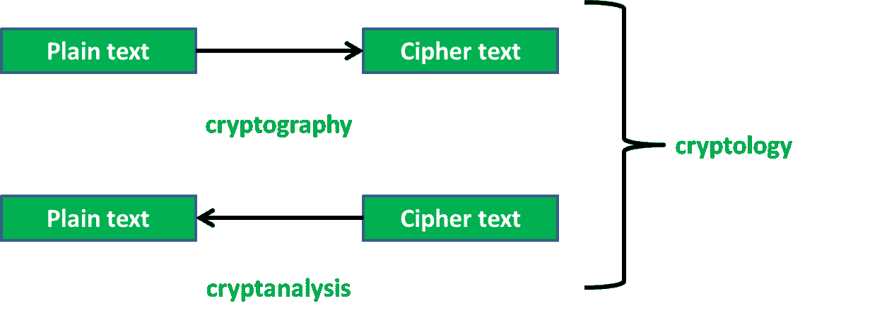
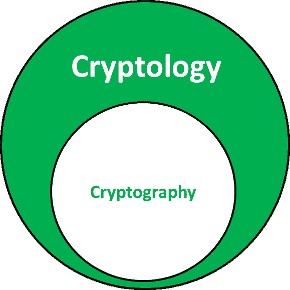

# 密码学和密码学的区别

> 原文:[https://www . geesforgeks . org/密码学与密码学的区别/](https://www.geeksforgeeks.org/difference-between-cryptography-and-cryptology/)

**密码学**是研究纯文本(可读格式)到密文(不可读格式)的转换，即加密。它也被称为加密的**研究**。

**密码学**则是研究纯文本到密文的转换，反之亦然。它也被称为加密和解密的**研究**。

一个主要区别是密码学是密码学的母体。

让我们看看其他的区别。

| Sl 号。 | 密码系统 | 密码学 |
| --- | --- | --- |
| 1. | 密码学是将纯文本转换为密文的过程。 | 密码学是将纯文本转换为密文的过程，反之亦然。 |
| 2. | 它也被称为加密研究 | 它也被称为加密和解密的研究。 |
| 3. | 它发生在发送方 | 它发生在发送方和接收方 |
| 4. | 在密码学中，发送者将消息发送给接收者。 | 在密码学中，发送者和接收者都互相发送信息。 |
| 5. | 密码学可以看作是密码学的产物 | 密码学可以看作是密码学的母体 |