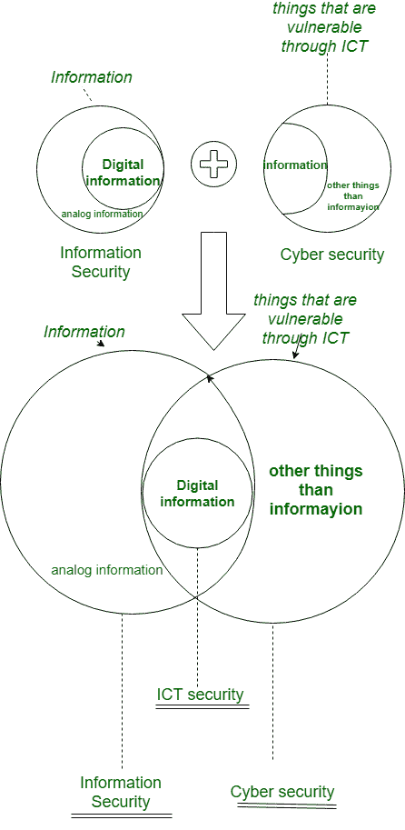

# 网络安全与信息安全的区别

> 原文:[https://www . geesforgeks . org/网络安全和信息安全的区别/](https://www.geeksforgeeks.org/difference-between-cyber-security-and-information-security/)

术语**网络安全**和 **[信息安全](https://www.geeksforgeeks.org/what-is-information-security/)** 经常互换使用。由于它们都负责安全和保护计算机系统免受威胁和信息泄露，并且通常网络安全和信息安全联系如此紧密，以至于它们看起来是同义词，不幸的是，它们被用作同义词。

如果我们谈论数据安全，那完全是为了保护数据免受恶意用户和威胁的侵害。现在另一个问题是数据和信息有什么区别？因此，有一点很重要，那就是“不是每一个数据都可以成为信息”，如果数据是在特定的环境和特定的意义下被解释的，那么它就可以被告知。例如**“100798”**是数据，如果我们知道这是一个人的出生日期，那么它就是信息，因为它有一些意义。所以信息意味着有一些意义的数据。

| 网络安全 | 信息安全 |
| --- | --- |
| 这是一种保护数据不受互联网上外部资源影响的做法。 | 这一切都是为了保护信息免受未经授权的用户、访问和数据修改或删除，以提供机密性、完整性和可用性。 |
| 它是关于保护网络空间免受网络攻击的能力。 | 它涉及保护数据免受任何形式的威胁。 |
| 网络安全保护网络领域的任何东西。 | 信息安全是针对信息的，与领域无关。 |
| 网络安全应对网络空间的危险。 | 信息安全涉及保护数据免受任何形式的威胁。 |
| 网络安全打击网络犯罪、网络欺诈和执法。 | 信息安全努力防止未经授权的访问、披露修改和破坏。 |
| 另一方面，负责网络安全的网络安全专业人员处理高级的持续威胁。 | 信息安全专业人员是数据安全的基础，与信息技术相关的安全专业人员在处理威胁之前首先确定资源的优先级。 |
| 它处理网络领域可能存在或不存在的威胁，例如保护您的社交媒体帐户、个人信息等。 | 它涉及信息资产、完整性、保密性和可用性。 |

下图显示了*信息安全*和*网络安全*的区别。

在上图中 **ICT** 指的是信息和通信技术(ICT)，它是信息技术(IT)的延伸术语，定义了统一通信和电信集成(基本上是数字通信安全)的作用。