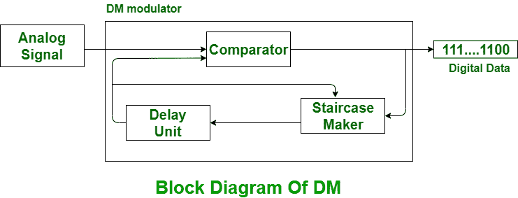
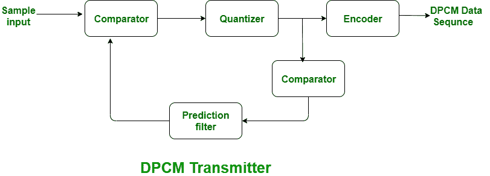
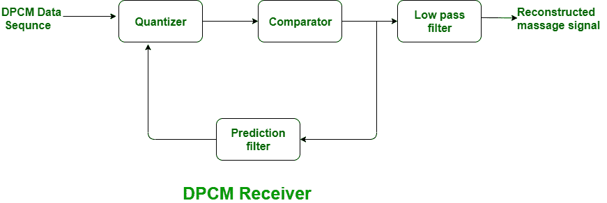

# 增量调制(DM)和差分脉码调制(DPCM)的区别

> 原文:[https://www . geeksforgeeks . org/delta 调制-dm 和差分脉冲编码调制-dpcm 之差/](https://www.geeksforgeeks.org/difference-between-delta-modulation-dm-and-differential-pulse-code-modulation-dpcm/)

**δ调制(DM):**
δ调制是相关模拟到数字和数字到模拟信号转换技术。利用增量调制来理解高信噪比的幅度关系。它使用一位 PCM 码来欣赏模拟信号的数字传输。对于增量调制，不是发送样本的编码图示，而是仅发送一位，这简单地指示样本是否大于或小于前一个样本。这是最有效或最简单的一种差分脉码调制。增量调制信号小于脉码调制系统。

**差分脉码调制(DPCM):**
DPCM 代表差分脉码调制，与用于将模拟信号返工为数字信号的脉码调制技术相同。差分脉码调制具有中等的信噪比。差分脉冲编码调制不同于脉冲编码调制，因为它量化了实际样本和期望值的优点。这就是它被称为差分脉冲编码调制(DPCM)的原因。
DPCM 发射机和 DPCM 接收机的操作如下图所示:

在上图中，如果信号较大，则数字数据的下一位为 1，否则下一位为 0。

我们来看看 DM 和 DPCM 的区别，下面给出:

| S.NO | 基于以下内容的比较 | 分米 | DPCM |
| --- | --- | --- | --- |
| 1. | 反馈 | 在 DM 中，反馈存在于变送器中。 | 这里，反馈存在于发射机和接收机中。 |
| 2. | 信噪比 | DM 信噪比差。 | DPCM 有相当的信噪比。 |
| 3. | 传输带宽 | 它需要最低的带宽。 | 这里，DPCM 比 PCM 需要更少的带宽。 |
| 4. | 级别、步长 | 在 DM 中，步长是固定的。 | 而在这里，级别的数量是固定的。 |
| 5. | 效率 | DM 的效率不如 DPCM。 | DPCM 更有效率。 |
| 6. | 位数 |

在数据挖掘中，每个样本只使用一位。这里使用多于一个但少于一个的脉码调制位。7.量化误差和失真斜坡霸王失真和颗粒噪声存在。存在斜坡霸王失真和量化噪声。8.应用程序它通常用于演讲和图像。It is mostly used in videos and speeches.