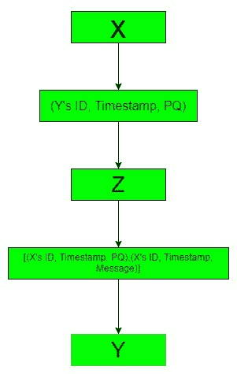

# 直接数字签名和仲裁数字签名的区别

> 原文:[https://www . geesforgeks . org/直接数字签名和仲裁数字签名的区别/](https://www.geeksforgeeks.org/difference-between-direct-and-arbitrated-digital-signature/)

先决条件–[数字签名](https://www.geeksforgeeks.org/digital-signatures-certificates/)
**直接数字签名**仅包括两方，一方发送消息，另一方接收消息。根据直接数字签名，双方相互信任并且知道公钥。消息容易被破坏，发送者可以随时拒绝他发送的消息。

**仲裁数字签名**包括三方，其中一方是发送方，第二方是接收方，第三方是仲裁方，仲裁方将成为他们之间发送和接收消息的媒介。由于默认情况下包含时间戳，因此消息不太容易损坏。

**直接数字签名和仲裁数字签名的区别:**

| **序列号** | **直接数字签名** | **仲裁数字签名** |
| --- | --- | --- |
| 1. | 它只需要通信方。 | 它需要仲裁器和通信方一起发送或接收消息。 |
| 2. | 在这种情况下，数字签名用发送方的私钥加密整个纯文本。 | 加密的消息由 X 发送到仲裁器 Z，带有 Y 的 id、时间戳和一些随机数 PQ。 |
| 3. | 消息在双方之间直接传输，不需要任何中介的帮助。 | 需要仲裁器来传输消息。 |
| 4. | 双方都不维护时间戳。 | 默认情况下，时间戳由所有三个成员维护。 |
| 5. | 在需要保密的情况下，消息将使用接收者的公钥或共享密钥进行加密。 | 仲裁器提供消息的机密性。 |
| 6. | 容易受到任何重放攻击。 | 时间戳用于保护消息免受任何类型的重放攻击。 |
| 7. | 它的时钟处理速度为 16 兆赫。 | 而树莓皮时钟的处理速度为 1.4 千兆赫。 |
| 8. | 它是使用公钥实现的。 | 它是使用私钥实现的。 |

