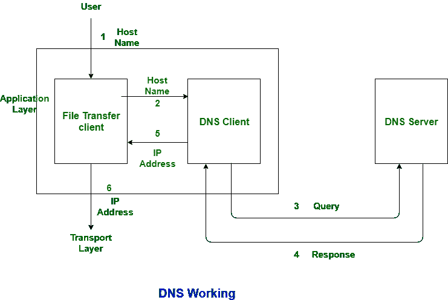
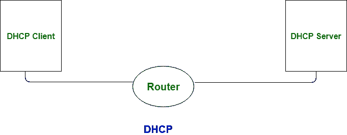

# DNS 和 DHCP 的区别

> 原文:[https://www . geesforgeks . org/DNS 和 dhcp 之间的区别/](https://www.geeksforgeeks.org/difference-between-dns-and-dhcp/)

**[域名系统(DNS)](https://www.geeksforgeeks.org/address-resolution-dns/) :**
在 DNS 中，借助 DNS 服务器，域名被翻译成 IP 地址，IP 地址被翻译成域名。域名系统的架构如下:

**[动态主机配置协议(DHCP)](https://www.geeksforgeeks.org/computer-network-dynamic-host-configuration-protocol-dhcp/) :**
和 DNS 服务器一样，它不把域名映射成 IP 地址，也不把 IP 地址映射成域名，DHCP 服务器是用来机械配置主机的。

让我们看看 DNS 和 DHCP 的区别:

| S.NO | 域名服务器(Domain Name Server) | 动态主机配置协议 |
| 1. | 域名系统代表域名系统。 | 而 DHCP 代表动态主机配置协议。 |
| 2. | 它在 53 端口号下工作。 | 而它在 67 和 68 端口号下工作。 |
| 3. | DNS 支持的协议有:UDP 和 TCP。 | 而在这种情况下，只使用 UDP 协议。 |
| 4. | DNS 是一个分散的系统。 | 而 DHCP 是集中式系统。 |
| 5. | 在 DNS 中，借助 DNS 服务器，域名被翻译成 IP 地址，IP 地址被翻译成域名。 | 在 DHCP 中，DHCP 服务器用于机械配置主机。 |
| 6. | 在 DNS 的帮助下，我们不需要记住 IP 地址。 | 是可靠的 IP 配置。 |

