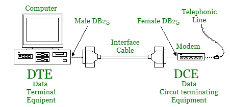

# DTE 和 DCE 的区别

> 原文:[https://www . geesforgeks . org/difference-DTE-and-DCE/](https://www.geeksforgeeks.org/difference-between-dte-and-dce/)

**1。数据终端设备(DTE) :**
它包括作为二进制数字数据的来源或目的地的任何单元。在[物理层](https://www.geeksforgeeks.org/layers-of-osi-model/)，它可以是终端、微型计算机、计算机、打印机、传真机、机器或任何其他生成或消费数字数据的设备。DTE 通常不传递信息，但需要一个中介来进行交流。

**2。数据电路终端设备(DCE) :**
它包括通过网络以模拟或数字信号形式发送或接收数据的任何功能单元。在物理层，DCE 接收数字地面设备产生的数据，将其转换成适当的信号，然后将信号引入电信链路。

这一层常用的 DCE 包括调制解调器。在任何网络中，数字地面设备都会生成数字数据，并将它们传递给 DCE。DCE 将该数据转换成传输介质可接受的形式，并将转换后的信号发送到网络上的另一个 DCE。第二个 DCE 把信号从线路上取下来，转换成它的 DTE 可以使用的形式，然后传送出去。

**DTE 和 DCE 的区别:**

| SR.NO | 数据终端设备(Data Terminal Equipment) | 数据通信设备(Data Communications Equipment) |
| --- | --- | --- |
| one | DTE 代表数据终端设备。 | DCE 代表数据通信设备。 |
| Two | 它是一种作为信息源或信息接收器的设备。 | 它是一种用作数据终端设备之间接口的设备。 |
| three | DTE 关注的是数据的来源或目的地。 | DCE 关注数据的通信方面。 |
| four | 它产生数据，并将数据传输到具有基本控制字符的 DCE。 | 它将信号转换成适合传输介质的格式，并将其引入网络线路。 |
| five | 它是通过 DCE 网络连接的。 | DCE 网络充当两个数字地面设备网络的媒介。 |
| six | DTE 的例子包括计算机、打印机和路由器等。 | DCE 的例子包括调制解调器、综合业务数字网适配器、卫星和网络接口卡等。 |

