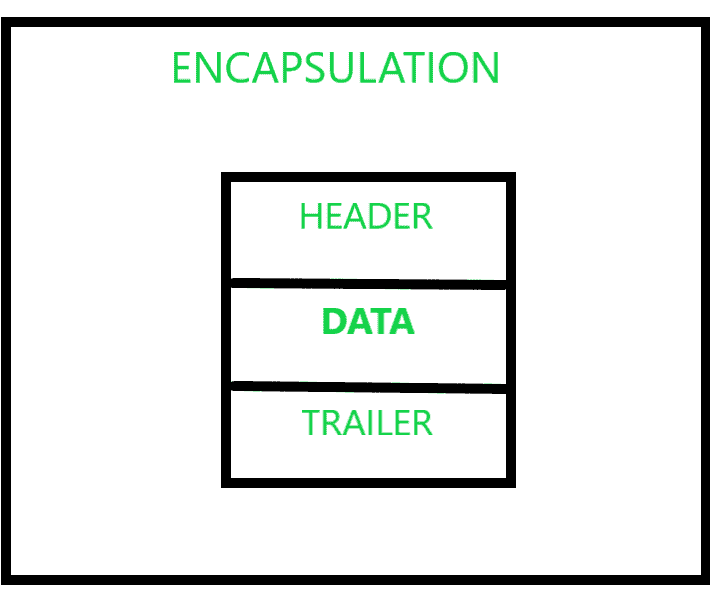
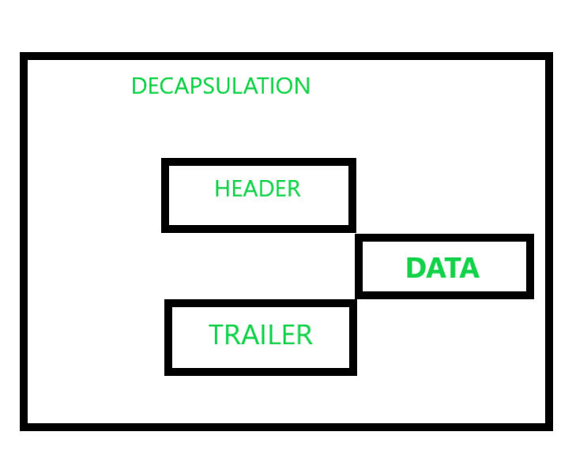

# 封装和解封装的区别

> 原文:[https://www . geesforgeks . org/封装和解封装的区别/](https://www.geeksforgeeks.org/difference-between-encapsulation-and-decapsulation/)

**概述:**
本文将让你了解封装&解封装，以及它们的区别。在任何类型的数据传输中，确保并建立两个或多个网络或设备之间的安全通信非常重要。只有在这个过程中所涉及的时间最少的情况下，整个传输才被认为是有效的。

**封装:**
封装是指在 [TCP/IP](https://www.geeksforgeeks.org/tcp-ip-model/) 模型中将新信息传递到下一层时，在应用层数据中附加新信息。这些附加信息基本上分为两部分，标题和尾部。这些都是附加的元素，为了使传输更加流畅，在每一层都会生成一个协议数据单元。封装的概念可以在前面附上的截图中总结。

**解封装:**
解封装是指去除所有这些附加信息，提取原来存在的数据，这个过程一直持续到最后一个[层](https://www.geeksforgeeks.org/similarities-between-tcp-ip-model-and-osi-model/?ref=rp)即应用层。这个过程会在每一层接近该层时，移除该层中不同信息的片段。这是整个过程的图示。

**封装和解封装的区别:**
现在，我们来看看封装和解封装的区别。

<figure class="table">

| **序列号** | 

**封装**

 | 衰变 |
| --- | --- | --- |
| 1. | 数据时刻从上层开始，到最底层结束。 | 而在这里，数据从下层移动到上层。 |
| 2. | 该过程包括增加头部和尾部。 | 该过程包括移除头部和尾部 |
| 3. | 这个过程首先执行，然后解封装。 | 一旦封装最终完成，这个过程就会执行。 |
| 4. | 它发生在源设备内部。 | 它发生在目标设备内部。 |

</figure>