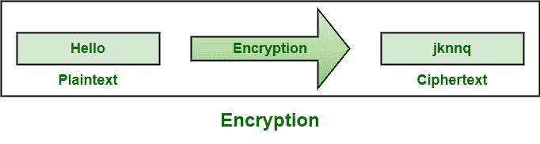
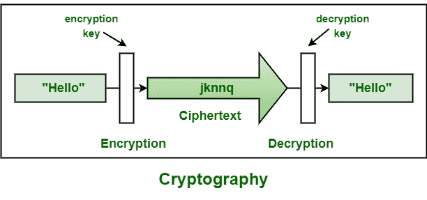

# 加密和密码学的区别

> 原文:[https://www . geeksforgeeks . org/加密与加密的区别/](https://www.geeksforgeeks.org/difference-between-encryption-and-cryptography/)

**1。加密:**
加密，顾名思义，通常是一种使用算法来隐藏消息的技术。用算法编码消息是密码学的基本应用。In 通常有助于保护隐私信息、敏感数据，并增强客户端应用程序和服务器之间的通信安全性。它被认为是最有效和最流行的数据安全技术之一。

**例:**

**2。密码学:**
密码学，顾名思义，就是研究像加密这样的方法。其主要目标是提供简单的方法，使用加密和相关技术来保护信息和通信。它只是允许人们存储敏感信息或通过不安全的网络传输信息，这样除了预期的接收者之外，任何人都无法读取或访问这些信息。它的功能包括认证、不可否认、保密和完整性。

**例:**

**加密和密码学的区别:**

<figure class="table">

| 

**加密**

 | 

**密码学**

 |
| --- | --- |
| 它是对消息或信息进行编码的过程，以便只有授权方才能访问它。 | 它研究的是在第三方存在的情况下进行安全通信的加密等技术。 |
| 它被认为是密码学的主要应用。 | 它被认为是使用加密和解密技术创造代码的艺术。 |
| 它只是用算法加密数据，用密钥解密。 | 它只是提供了通过加密及其相关过程来保护数据的方法。 |
| 它本质上是关于数学和算法的。 | 这都是关于自然中的技术和工艺。 |
| 它的主要目的是保密，即通过将信息翻译成代码来隐藏信息内容。 | 其主要目的是应用复杂的数学和逻辑设计强加密方法。 |
| 加密类型包括对称加密和非对称加密。 | 密码学的类型包括对称密钥密码学和非对称密钥密码学。 |
| 它始终为数据提供安全性，保持完整性，保护隐私，跨设备保护数据等。 | 提供加密技术等可以保护信息和通信的技术，以及加密技术(如媒体访问控制和数字签名)来保护信息免受欺骗和伪造。 |
| 它遵循相同的方法，包括一些术语，如密文、明文和密码。 | 它有对称和非对称版本，有共享和非共享密钥的概念。 |
| 它有助于数字签名等现代数据安全，并保护电子邮件和密码等敏感电子数据。 | 它在电子商务、军事通信、基于芯片的卡支付、数字货币、时间戳等方面非常有用。 |

</figure>