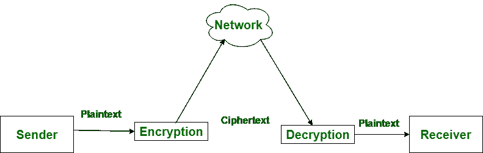

# 加密和解密的区别

> 原文:[https://www . geesforgeks . org/加密和解密的区别/](https://www.geeksforgeeks.org/difference-between-encryption-and-decryption/)

**加密**是将正常消息(明文)转换为无意义消息(密文)的过程。而**解密**是将无意义的消息(密文)转换为其原始形式(明文)的过程。

秘密写作和相关秘密写作的主要区别在于，秘密写作是将信息转换成一种不可理解的类型，除非解密，否则无法破译。而秘密写入是从加密信息中恢复第一个消息。

让我们看看加密和解密的区别:

| S.NO | 加密 | [通信]解密 |
| 1. | 加密是将正常消息转换成无意义消息的过程。 | 而解密是将无意义的信息转换成其原始形式的过程。 |
| 2. | 加密是发生在发送端的过程。 | 而解密是发生在接收端的过程。 |
| 3. | 它的主要任务是将明文转换成密文。 | 而它的主要任务是将密文转换成纯文本。 |
| 4. | 任何消息都可以用密钥或公钥加密。 | 而加密的消息可以用密钥或私钥解密。 |
| 5. | 在加密过程中，发送方将数据加密后发送给接收方。 | 而在解密过程中，接收者接收信息(密文)并转换成纯文本。 |