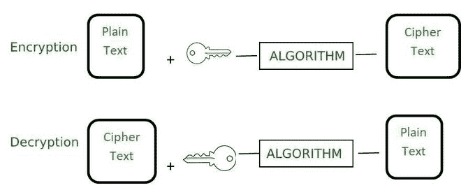
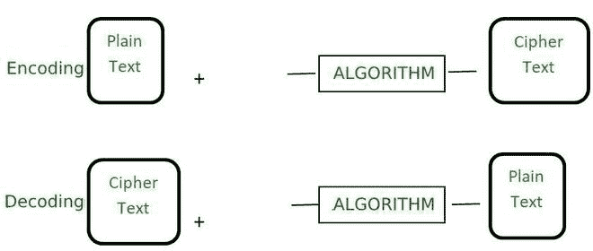

# 加密和编码的区别

> 原文:[https://www . geesforgeks . org/加密和编码的区别/](https://www.geeksforgeeks.org/difference-between-encryption-and-encoding/)

**加密和编码**是经常互换和使用不正确的术语。这两个术语之间有很大的差异，了解这些差异非常重要。在本文中，我们将了解加密和编码这两个术语之间的区别。

**1。加密:**

这是一个用于将称为纯文本的简单可读数据转换为称为密文的不可读数据的过程，只有当用户知道加密密钥时，密文才能转换为纯文本。它基本上用于保护我们的数据安全。加密的主要目的是将我们的数据转换成对不知道加密密钥的人来说是垃圾的形式。它用于防止未经授权的 ace。加密的反义词是解密，它用于从密文中获取纯文本。对于解密，我们必须知道加密密钥和加密算法。

加密数据就像其他数据一样对待。我们还可以对同一数据使用多种加密算法。现实生活中的例子是向某人发送只有他们才能阅读的秘密信息，或者通过互联网安全地发送密码。目标是数据保密。

**加密算法示例:** AES、RSA 和河豚。

**2。编码:**

它是将数据转换为不同类型系统可以轻松使用的格式的过程。用于编码数据的算法是公共可用的，如果人们知道该算法，就可以很容易地以可读的形式解码。它不需要任何密钥来解码信息。主要目的是数据可用性，而不是保密性。编码的主要目的是转换数据，以便不同类型的系统可以正确使用。它不用于保护数据，因为与加密相比，它很容易反转。

该过程用于确保数据的完整性和可用性。现实生活中的例子就像通过电子邮件发送二进制数据或在网页上查看特殊字符。主要目标是数据可用性。

**编码算法示例** : ASCII、UNICODE、网址编码、Base64

**加密和编码的区别:**

<figure class="table">

| **基础** | **加密** | **编码** |
| **定义** | 它是对数据进行安全编码的过程，这样只有知道密钥或密码的授权用户才能为其他人检索原始数据。它只是垃圾。 | 它是将数据转换成一种格式的过程，这种格式可以由不同类型的系统使用公共可用的算法来处理。 |
| **目的** | 加密的目的是转换数据，使其对他人保密。 | 主要目的是保护数据的完整性。 |
| **用于** | 它用于维护数据机密性。 | 它用于维护数据可用性。 |
| **反向过程** | 使用解密可以检索原始数据。 | 可以使用解码来检索原始数据。用于编码数据的算法是公开的。 |
| **关键要求** | 解密数据和获取原始数据需要加密密钥。 | 解密数据和获取原始数据不需要加密密钥。 |
| **固定** | 加密的数据更安全。 | 编码数据不太安全。很容易解码。 |
| **算法示例** | AES、RSA 和河豚。 | ASCII，UNICODE，URL 编码，Base64。 |
| **真实例子** | 通过互联网安全发送密码。 | 查看网页上的特殊字符。 |

</figure>