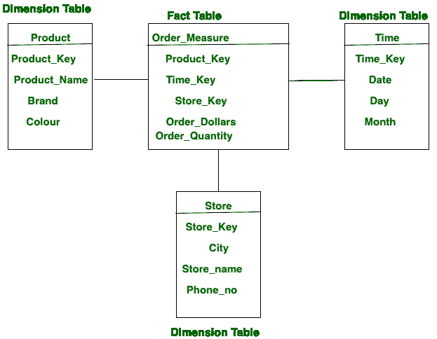

# 事实表和维度表的区别

> 原文:[https://www . geesforgeks . org/事实表和维度表之间的差异/](https://www.geeksforgeeks.org/difference-between-fact-table-and-dimension-table/)

现实或事实表的记录可以是来自完全不同维度表的属性的组合。**事实表或现实表**帮助用户调查业务维度，这有助于用户接听电话以提升业务。

另一方面，**维度表**便于实景表或事实表收集需要采取措施的维度。

事实表或事实表与维度表之间的主要区别在于维度表包含的属性取决于实际采取的度量。

**事实表和维度表的区别:**

<figure class="table">

| S.NO | 

事实表

 | 

维度表

 |
| --- | --- | --- |
| 1. | 事实表包含维度表属性的度量。 | 维度表包含真值表上计算度量的属性。 |
| 2. | 事实上，表的属性比维度表少。 | 而在维度表中，属性比事实表多。 |
| 3. | 事实表，记录比维度表多。 | 而在维度表中，记录比事实表少。 |
| 4. | 事实表形成了一个垂直表。 | 而维度表形成水平表。 |
| 5. | 事实表的属性格式有数值格式和文本格式。 | 而维度表的属性格式是文本格式。 |
| 6. | 它在维度表之后。 | 当它出现在事实表之前。 |
| 7. | 事实表的数量少于架构中的维度表。 | 而在一个模式中维度的数量多于事实表。 |
| 8. | 它用于分析目的和决策。 | 而维度表的主要任务是存储关于业务及其流程的信息。 |

</figure>