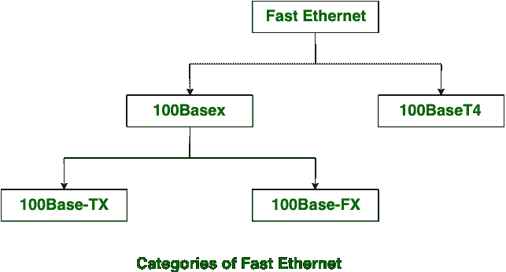

# 快速以太网和千兆以太网的区别

> 原文:[https://www . geeksforgeeks . org/快速以太网和千兆以太网的区别/](https://www.geeksforgeeks.org/difference-between-fast-ethernet-and-gigabit-ethernet/)

[以太网](https://www.geeksforgeeks.org/local-area-network-lan-technologies/)有几种类型:

1.  快速以太网
2.  千兆以太网
3.  交换以太网

**快速以太网**是 10 Base-T 以太网的继承者。它比千兆以太网更受欢迎，因为它的配置和实现简单。它比它的后继者更快。其变体有:

1.  100Base-T4
2.  100Base-Tx
3.  100Base-Fx

快速以太网的覆盖范围上限为 10 公里，其在快速以太网中的往返延迟为 100 至 500 位次。

**千兆以太网**是快速以太网的继承者。它可以产生高达 1 Gbps 的速度。它不如快速以太网受欢迎，因为它的配置和实现比快速以太网复杂。千兆以太网的覆盖极限高达 70 公里。

让我们看看快速以太网和千兆以太网的区别:

<figure class="table">

| S.NO | 快速以太网 | 千兆以太网 |
| --- | --- | --- |
| 1. | 快速以太网提供 100 Mbps 的速度。 | 千兆以太网提供 1 Gbps 的速度。 |
| 2. | 快速以太网配置简单。 | 而千兆以太网比快速以太网复杂。 |
| 3. | 相对而言，快速以太网会产生更多的延迟。 | 千兆以太网比快速以太网产生更少的延迟。 |
| 4. | 快速以太网的覆盖范围上限为 10 公里。 | 而千兆以太网的覆盖极限高达 70 公里。 |
| 5. | 快速以太网中的往返延迟是 100 到 500 位时间。 | 而千兆以太网中的往返延迟是 4000 位倍。 |
| 6. | 快速以太网是 10-Base-T 以太网的继承者。 | 而千兆以太网是快速以太网的继承者。 |

</figure>