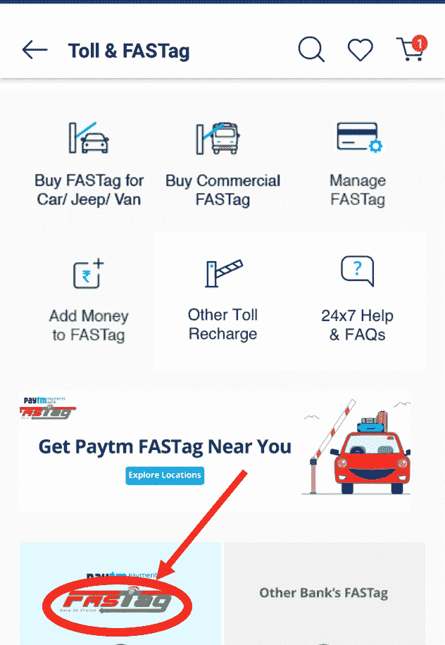

# Fastag、二维码、NFC 的区别

> 原文:[https://www . geeksforgeeks . org/区别-fastag-qr-code-and-nfc/](https://www.geeksforgeeks.org/difference-between-fastag-qr-code-and-nfc/)

**1。**[**Fastag**](https://www.geeksforgeeks.org/introduction-of-radio-frequency-identification-rfid/)**:**
Fastag 通过扫描仪扫描标签，提供了一种新的缴纳通行费的方式。通行费直接从司机的银行账户中扣除。这使得收取和支付通行费免于麻烦，而且比传统的现金方式快得多。

**paytm 应用程序上的 Fastag 选项**

**2。** [**二维码**](https://www.geeksforgeeks.org/how-to-generate-and-read-qr-code-with-java-using-zxing-library/) **:**
二维码提供了一种以图形格式存储数据的新方式。这些数据由二维码扫描仪扫描，以了解其中包含的内容。这些广泛应用于社交媒体平台和非接触式支付服务。

**扫描到 www.geeksforgeeks.org 的二维码**

**3。** [**【近场通信】**](https://www.geeksforgeeks.org/near-field-communication-nfc/) **:**
近场通信是一种利用设备中天线的电感耦合进行近距离通信和数据传输的方法。它为两个连接的设备之间的通信提供了规则。这是一项相对较新的技术，由弗朗茨·阿姆特曼和菲利普·曼加斯于 2002 年开发。

**扬声器上的 NFC 功能**

**Fastag、二维码、NFC 的区别:**

<figure class="table">

| 没有。 | Fastag | 二维码 | 国家足球联盟 |
| --- | --- | --- | --- |
| 1. | 2014 年是它发展的一年。 | 1994 年是它发展的一年。 | 2002 年是它发展的一年。 |
| 2. | 它是由印度国家支付公司开发的。 | 它是由原正弘开发的。 | 它是由弗朗茨·阿姆特曼和菲利普·曼加斯开发的。 |
| 3. | Fastags 没有进一步细分。 | 它只有一种类型(没有细分)。 | 它只有一种类型(没有细分)。 |
| 4. | 利用射频识别技术征收通行费的方法。 | 可扫描以进行数据检索的 2D 条形码类型或打印数据表示。 | 4 厘米距离内设备(电子设备)之间通信的通信协议。 |
| 5. | 印度(NHAI)国家公路局用它来征收通行费。 | 超市、医院、电影院或个人使用。用于传输数据(共享联系人、照片、视频和其他文档)。 | 在零售、汽车、电影院等各个行业中，它被用作身份证、钥匙卡以及非接触式支付和移动支付的方法。 |
| 6. | 基于射频识别技术。 | 基于莫尔斯电码技术。 | 基于设备天线之间的电感耦合。 |
| 7. | 不需要视线。 | 它需要视线。 | 它需要接近(距离 4 厘米，因此得名，近场)。 |
| 8. | 可以同时扫描和处理几个 Fastags。 | 一次只扫描处理一个二维码。 | 一次只扫描和处理一个 NFC。 |

</figure>