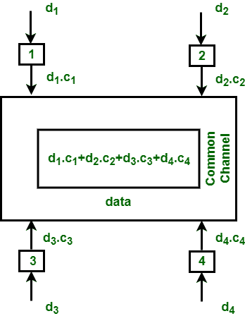

# FDMA 和 CDMA 的区别

> 原文:[https://www . geeksforgeeks . org/FDMA 和-cdma 的区别/](https://www.geeksforgeeks.org/difference-between-fdma-and-cdma/)

**1。频分多址(FDMA) :**
FDMA 是信道化协议，其中带宽被划分为各种频带。每个站都分配有用于发送数据的频带，并且该频带始终为特定站保留，如下所示:

不同站的频带被未使用的小频带分开，并且未使用的频带被称为防止站的干扰的保护频带。这就像数据链路层中的访问方法，在这种方法中，每个站的数据链路层告诉它的物理层从传递给它的数据中产生带通信号。信号是在分配的频带中创建的，并且在[物理层](https://www.geeksforgeeks.org/layers-of-osi-model/)没有物理多路复用器。

**2。码分多址(CDMA) :**
在 CDMA 中，所有的站都可以同时传输数据。它允许每个站一直在整个频率上传输数据。多个同时传输由唯一的代码序列分开。每个用户都被分配了一个唯一的代码序列。

在上图中，有 4 个站点标记为 1、2、3 和 4。分配给各站的数据为 d 1 、d 2 、d3 和 d 4 ，分配给各站的代码为 c 1 、c 2 、c 3 和 c 4 。

**FDMA 阿卜德码分多址的区别:**

| -你好。不，不。 | FDMA | 分码多重进接ˌ码分多址(Code Division Multiple Access) |
| --- | --- | --- |
| 1. | FDMA 代表频分多址。 | 码分多址代表码分多址。 |
| 2. | 不同站点之间共享带宽。 | 不同站点之间共享带宽和时间。 |
| 3. | 不需要任何码字。 | 码字是必须的。 |
| 4. | 只需要相邻信道之间的保护频带是必要的。 | 在这种情况下，保护带和保护时间都是必要的。 |
| 5. | 可变传输速率是困难的。 | 可变传输速率很容易.. |
| 6. | 没有远近问题。 | 存在远近问题。 |
| 7. | 在这种情况下，可以降低功率效率。 | 在这种情况下，需要全功率效率。 |
| 8. | 系统容量低。 | 系统容量大。 |
| 9. | 成本很高。 | 在这种情况下，仅安装成本高，运行成本低。 |
| 10. | 它不太灵活。 | 它更灵活。 |

