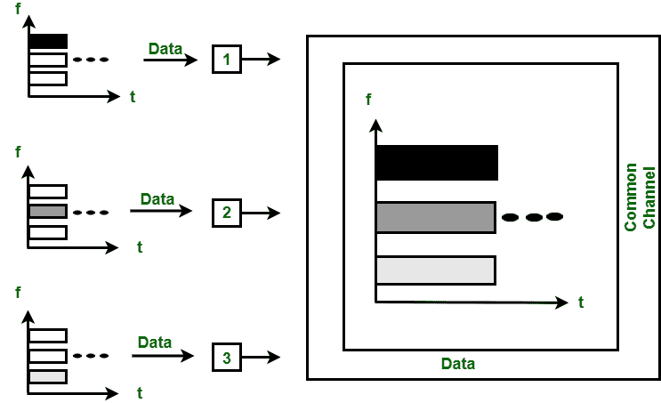

# 【TDMA、时分多址和码分多址的区别

> 原文:[https://www . geesforgeks . org/FDMA-tdma-和-cdma 之间的差异/](https://www.geeksforgeeks.org/difference-between-fdma-tdma-and-cdma/)

**1。频分多址(FDMA) :**
FDMA 是一种信道化协议。在这个带宽被划分成不同的频带。每个站都分配有用于发送数据的频带，并且该频带始终为特定站保留，如下所示:

图-FDMA

不同站的频带被未使用的小频带分开，并且未使用的频带被称为防止站的干扰的保护频带。这就像数据链路层中的访问方法，其中每个站的[数据链路层](https://www.geeksforgeeks.org/design-issues-in-data-link-layer/)告诉其物理层从传递给它的数据中产生带通信号。信号是在分配的频带中创建的，在物理层没有物理多路复用器。

**2。时分多址(时分多址):**
时分多址是一种信道化协议，其中信道带宽按时间划分到不同的站。每个站都有一个时隙，该站只能在该时隙内传输数据，如下所示:

图–CDMA

每个站必须知道其时隙的开始和时隙的位置。时分多址需要不同站之间的同步。它是数据链路层的一种访问方法。在每个站，数据链路层告诉站使用分配的时隙。

**3。码分多址(CDMA) :**
在 CDMA 中，所有的站都可以同时传输数据。它允许每个站一直在整个频率上传输数据。多个同时传输由唯一的代码序列分开。每个用户都被分配了一个唯一的代码序列。

图–CDMA

在上图中，有 4 个站点标记为 1、2、3 和 4。分配给各站的数据为 d 1 、d 2 、d 3 和 d 4 ，分配给各站的代码为 c 1 、c 2 、c 3 和 c 4 。

**FDMA、CDMA、TDMA 的区别:**

| FDMA | 分时多址(Time Division Multiple Address) | 分码多重进接ˌ码分多址(Code Division Multiple Access) |
| --- | --- | --- |
| FDMA 代表频分多址。 | 时分多址代表时分多址。 | 码分多址代表码分多址。 |
| 在这种情况下，不同站点之间共享带宽。 | 在这种情况下，只有卫星转发器的时间共享发生。 | 在这种情况下，不同站点共享带宽和时间。 |
| 不需要任何码字。 | 不需要任何码字。 | 码字是必须的。 |
| 在这种情况下，只需要相邻信道之间的保护频带是必要的。 | 在这种情况下，相邻时隙的保护时间是必要的。 | 在这种情况下，保护带和保护时间都是必要的。 |
| 不需要同步。 | 需要同步。 | 不需要同步。 |
| 数据速率很低。 | 数据速率中等。 | 数据率很高。 |
| 数据传输模式是连续信号。 | 数据传输模式是以 burts 为单位的信号。 | 数据传输模式是数字信号。 |
| 它有点不灵活。 | 它适度灵活。 | 它非常灵活。 |

