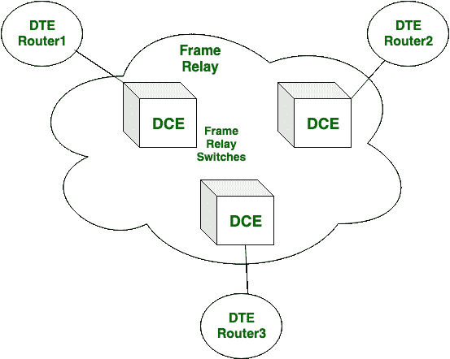
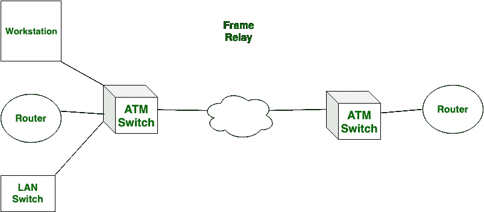

# 帧中继和 ATM 的区别

> 原文:[https://www . geesforgeks . org/帧中继和 atm 的区别/](https://www.geeksforgeeks.org/difference-between-frame-relay-and-atm/)

**帧中继:**
帧中继是以数据包的形式通过电路层传输信息的传输模式。它提供从 Kbps 到 Mbps 的信息速度。帧中继的数据包大小可变。它没有给出错误管理和流程管理。帧中继的责任较小。

**异步传输模式(ATM):**
ATM 已装入数据包大小。它提供 155.5 兆位/秒或 622 兆位/秒的信息速度。自动柜员机提供错误管理和流量管理。它比帧中继可靠得多。

让我们看看帧中继和自动柜员机的区别:

| S.NO | 帧中继 | 异步传输模式 |
| 1. | 帧中继的数据包大小可变。 | 而 ATM 有固定的包大小。 |
| 2. | 帧中继的成本很低。 | 虽然它比帧中继贵。 |
| 3. | 在帧中继中，数据包延迟更多。 | 在这种情况下，数据包延迟很低或更低。 |
| 4. | 帧中继的可靠性较差。 | 虽然它是一个好的可靠的。 |
| 5. | 帧中继的数据包传输速度较低。 | 而 ATM 的包传输速度较高。 |
| 6. | 帧中继的吞吐量适中。 | 虽然它的吞吐量很高。 |
| 7. | 帧中继不提供错误控制和流量控制。 | 而 ATM 提供差错控制和流量控制。 |

