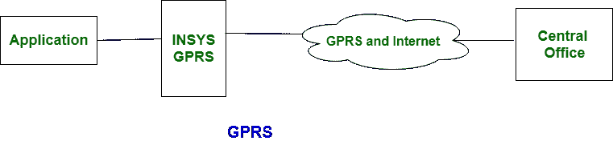
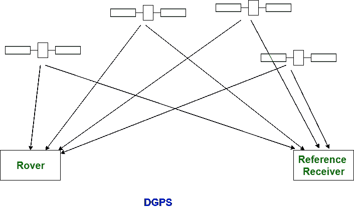

# 【GPRS 和 DGPS 的区别

> 原文:[https://www . geeksforgeeks . org/GPRS 和-dgps 之间的差异/](https://www.geeksforgeeks.org/difference-between-gprs-and-dgps/)

[GPRS](https://www.geeksforgeeks.org/general-packet-radio-service-gprs/) 代表**通用分组无线业务**，而 **DGPS** 代表**差分全球定位系统。** GPRS 用于视频通话、电子邮件访问、多媒体消息等。它的主要目标是在手机中提供数据和语音。而 DGPS 用于卫星导航系统。

GPRS 和 DGPS 之间的根本区别在于，GPRS 用于授权主要基于蜂窝的信息服务。另一方面，DGPS 用于提供局部坐标系。

让我们看看 GPRS 和 DGPS 的区别:

| S.NO | 通用分组无线业务 | 差分全球定位系统(Differential Global Positioning System) |
| --- | --- | --- |
| 1. | GPRS 代表通用分组无线业务。 | 而 DGPS 代表差分全球定位系统。 |
| 2. | GPRS 不太贵。 | 而 DGP 的成本比 gprs 更高。 |
| 3. | 它不能在任何地方使用，只能在有限范围内在陆地上使用。 | 而 dgps 的仪器范围是本地的。 |
| 4. | 在 gprs 中，许多接收器被取代。 | 在差分全球定位系统中，有两个接收器。 |
| 5. | GPRS 中需要一个站。 | 而 DGPS 需要两个车站。 |
| 6. | 它的主要目标是在手机中提供数据和语音。 | 而它的主要目标是提供局部坐标系。 |