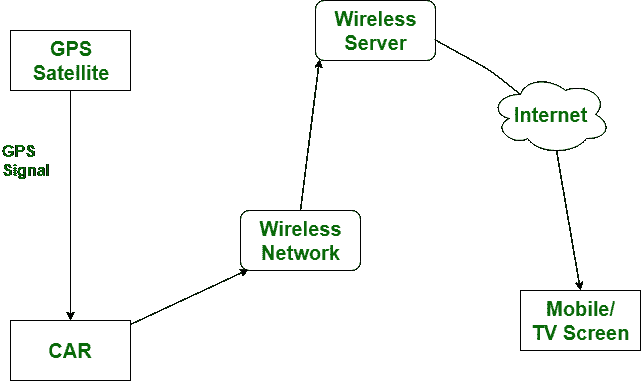

# 全球定位系统和 GPRS 的区别

> 原文:[https://www . geesforgeks . org/GPS 和 gprs 的区别/](https://www.geeksforgeeks.org/difference-between-gps-and-gprs/)

**[GPS](https://www.geeksforgeeks.org/how-gps-works/)** 代表**全球定位系统。**而 **GPRS** 代表**通用分组无线业务。**全球定位系统用于卫星导航系统、制图以及地理信息系统等。而 GPRS 用于视频通话、电子邮件访问、多媒体消息等。

全球定位系统和 GPRS 的区别在于，全球定位系统是基于卫星的导航系统。另一方面，GPRS 用于授权主要基于蜂窝的信息服务。

让我们看看全球定位系统和 GPRS 的区别:

| S.NO | 全球（卫星）定位系统 | 通用分组无线业务 |
| 1. | 全球定位系统代表全球定位系统。 | 另一方面，GPRS 代表通用分组无线业务。 |
| 2. | 全球定位系统比 GPRS 贵。 | 而 GPRS 则便宜一些。 |
| 3. | 全球定位系统需要 3 个或 3 个以上的站。 | 而 GPRS 中需要一个站。 |
| 4. | 其主要目标是提供站立或定位服务。 | 而 ts 的主要目标是在移动电话中授权数据和语音。 |
| 5. | 全球定位系统可以在任何地方使用。 | 虽然它不能在任何地方使用，但它只能在有限范围内用于陆地。 |
| 6. | 全球定位系统是用许多卫星宣传的。 | 同时用地面塔进行宣传。 |
| 7. | GPS 可以与 GSM、LTE、WiMAX 等多种技术协同工作。 | GPRS 系统是 GSM 网络交换的一个集成部分 |
| 8. | 全球定位系统的应用是在勘探，测量，测绘等。 | GPRS 的应用是访问电子邮件、彩信、视频通话等。 |