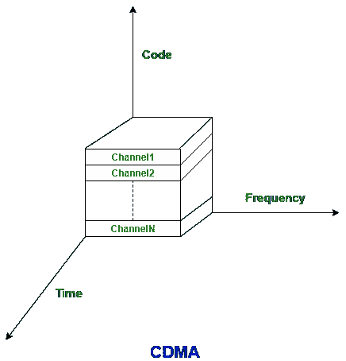

# GSM 和 CDMA 的区别

> 原文:[https://www . geeksforgeeks . org/GSM 和 cdma 的区别/](https://www.geeksforgeeks.org/difference-between-gsm-and-cdma/)

**[GSM](https://www.geeksforgeeks.org/how-gsm-works/)** 代表**全球移动通信系统**，而 **[CDMA](https://www.geeksforgeeks.org/java-cdma-code-division-multiple-access/)** 代表**码分多址** GSM 使用 FDMA(频分多址)和 TDMA(时分多址)。GSM 支持同时传输数据和语音，但是 CDMA 没有这个功能。

GSM 和 CDMA 的主要区别是，在 GSM 中，客户信息放在 SIM 卡上，可以移动到新的手机上。而只有来自一组白名单公司的移动电话可以用于码分多址网络。

GSM 和 CDMA 的区别如下:

| 序列号 | 克重 | 分码多重进接ˌ码分多址(Code Division Multiple Access) |
| 1.完全形式 | 全球移动通信系统。 | 码分多址。 |
| 2.使用的技术 | FDMA(频分多址)和时分多址(时分多址)。 | 码分多址。 |
| 3.有效性 | 全球移动通信系统在全球范围内被广泛使用和使用。 | 码分多址在较少的国家和运营商可用。 |
| 4.数据速率 | HSPA 42 兆位/秒(3G)。 | 在 CDMA 中为 3.6Mbps。 |
| 5.特征 | GSM 支持同时传输数据和语音。 | CDMA 不支持此功能。 |
| 6.客户信息 | 存储在 SIM 卡中。 | 储存在耳机或手机中。 |