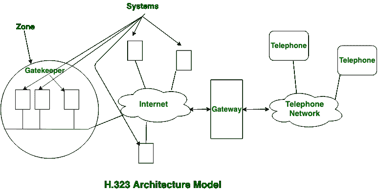
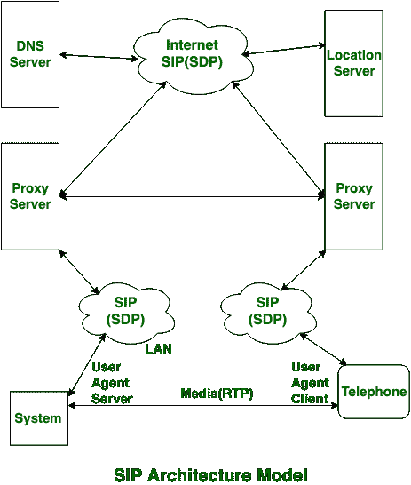

# 【H.323 和 SIP 的区别

> 原文:[https://www . geeksforgeeks . org/区别-h-323-和-sip/](https://www.geeksforgeeks.org/difference-between-h-323-and-sip/)

**H.323 :**
H.323 是以电话为主的系统。而且它的设计是单片设计。H.323 的范围或可量化性受到限制，它的通用性很小。H.323 没有赋予即时电子消息的力量。

**会话发起协议(SIP):**
SIP 是会话层协议。它的设计是标准设计。Sip 比 H.323 更健康，也比 H.323 更通用。Sip 提供了即时电子消息的能力。

让我们看看 H.323 和 SIP 的区别:

| S.NO | H.323 | 啜饮 |
| 1. | H.323 是单片架构。 | SIP 是模块化架构。 |
| 2. | H.323 的可扩展性有限。 | SIP 的可扩展性更好。 |
| 3. | H.323 有点灵活。 | 它更灵活。 |
| 4. | H.323 不提供即时消息功能。 | SIP 提供了即时消息的功能。 |
| 5. | 就复杂性而言，H.323 绝对复杂。 | 就复杂性而言，它是中度复杂的。 |
| 6. | H.323 的消息格式是二进制形式。 | 而 sip 的消息格式是 ASCII 格式。 |
| 7. | 它与互联网不兼容。 | 同时与互联网兼容。 |
| 8. | H.323 完全建立在电话系统上。 | 而 SIP 完全依赖互联网连接。 |