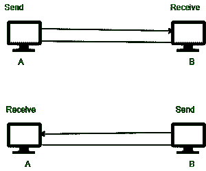

# 半双工传输模式和全双工传输模式的区别

> 原文:[https://www . geeksforgeeks . org/半双工传输模式和全双工传输模式的区别/](https://www.geeksforgeeks.org/difference-between-half-duplex-transmission-modes-and-full-duplex-transmission-modes/)

**1。半双工模式:**
半双工模式是指发送方可以发送数据，也可以接收数据，但一次只能接收一个数据。它是双向的，即双向通信，但一次只能有一个。

**2。全双工模式:**
全双工模式是指发送方可以发送数据，也可以同时接收数据。它是双向的，即同时双向通信。

**半双工传输模式和全双工传输模式的区别:**

<figure class="table">

| Sr.No | 半双工模式 | 全双工模式 |
| 1. | 发送者可以发送和接收数据，但一次只能完成一项任务。 | 发送者可以同时发送和接收数据。 |
| 2. | 在半双工中，数据流是双向的，但一次只能有一个。 | 在全双工模式下，数据流是双向的，并且是同时的。 |
| 3. | 半双工模式提供的性能低于全双工模式。 | 全双工比半双工模式提供更好的性能。 |
| 4. | 在这种情况下，传输过程中的带宽利用率较低。 | 在这种情况下，带宽利用率提高了一倍。 |
| 5. | 在这种情况下，两个系统通过点对点链路连接，以发送和接收信号。两端一次只能传输一个信号。 | 在这种情况下，信号是双向传输的；两个终端站可以同时接收和发送数据。全双工模式需要两个独立的传输通道，一个用于接收数据，另一个用于传输数据。 |
| 6. | 对讲机和文本消息是半双工模式的例子。 | 电话、即时聊天室、音频视频通话都是全双工模式的例子。 |

</figure>