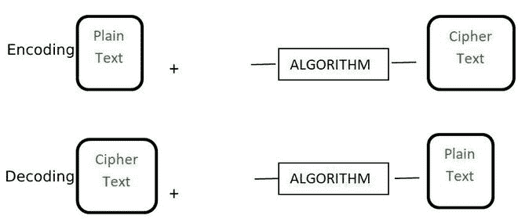
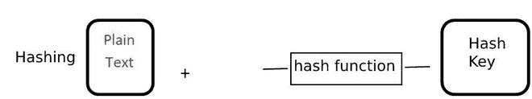

# 散列和加密的区别

> 原文:[https://www . geesforgeks . org/哈希和加密的区别/](https://www.geeksforgeeks.org/difference-between-hashing-and-encryption/)

**加密和散列**是密码学中广泛使用的两个术语。在本文中，我们将了解加密和哈希之间的区别。

**1。加密:**

加密是将称为明文的正常可读消息转换为称为密文的垃圾消息或不可读消息的过程。通过加密获得的密文可以很容易地使用加密密钥转换成明文。加密算法的一些例子有 RSA、AES 和 Blowfish。

**2。哈希:**

散列是使用散列函数将信息转换成密钥的过程。无法通过任何方式从哈希键中检索原始信息。通常，散列关键字存储在数据库中，并对它们进行比较，以检查原始信息是否匹配。它们通常用于存储登录密码。哈希算法的一些例子是 MD5，SHA256。

**哈希和加密的区别:**

<figure class="table">

| **基础** | **散列** | **加密** |
| **定义** | 这是一个将信息转换为更短的固定值(称为密钥)的过程，用于表示原始信息。 | 它是对数据进行安全编码的过程，这样只有知道密钥或密码的授权用户才能为其他人检索原始数据。它只是垃圾。 |
| **目的** | 散列的目的是从数据库中索引和检索项目。这个过程非常快。 | 加密的目的是转换数据，使其对他人保密。 |
| **反向过程** | 哈希代码或密钥不能通过任何方式反转为原始信息。它只能被映射，并且如果散列码相同，则检查散列码，否则信息相同。无法检索原始信息。 | 如果我们知道用于加密的加密密钥和算法，原始信息可以很容易地检索到。 |
| **固定** | 与加密相比，它更安全。 | 与哈希相比，它不太安全。 |
| **文件的创建** | 通常，它会尝试为传递给哈希函数的每个信息生成一个新的密钥，但在极少数情况下，它可能会生成通常称为冲突的相同密钥。 | 它将始终为每个信息生成一个新密钥。 |
| **例** | MD5，SHA256 | RSA、AES 和河豚 |
| **信息长度** | 哈希信息通常很小且长度固定。它不会随着信息长度的增加而增长。 | 加密信息的长度不是固定的。它随着信息长度的增加而增长。 |

</figure>