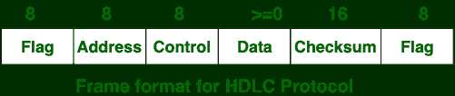
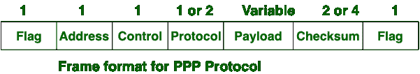

# 高级数据链路控制(HDLC)和点对点协议(PPP)的区别

> 原文:[https://www . geeksforgeeks . org/区别-高级-数据链路-控制-HDLC-点对点协议-ppp/](https://www.geeksforgeeks.org/difference-between-high-level-data-link-control-hdlc-and-point-to-point-protocol-ppp/)

**高级数据链路控制(HDLC)** 和**点对点协议(PPP)** 的主要区别在于，高级数据链路控制是面向比特的协议，而点对点协议是面向字节的协议。

HDLC 和 PPP 的另一个区别是，HDLC 通过点对点配置实现，另一方面也通过多点配置实现，而 PPP 仅通过点对点配置实现。

让我们看看 HDLC 和购买力平价之间区别:

| S.NO | 高级数据链路控制(High - level Data Link Control) | 巴基斯坦人民党 |
| 1. | HDLC 代表高级数据链路控制。 | PPP 代表点对点协议。 |
| 2. | HDLC 是一个面向比特的协议。 | PPP 是一种面向字节的协议。 |
| 3. | HDLC 通过点对点配置和多点配置实现。 | PPP 仅通过点对点配置实现。 |
| 4. | HDLC 不提供动态寻址。 | 而在这种情况下，提供了动态寻址。 |
| 5. | HDLC 用于同步媒体。 | PPP 用于同步媒体和异步媒体。 |
| 6. | HDLC 与非思科设备不兼容。 | PPP 与非思科设备兼容。 |
| 7. | HDLC 不提供链接认证。 | 而 PPP 则使用各种协议提供链路认证。 |
| 8. | 相对而言，HDLC 的成本更高。 | 而购买力平价的成本相对较低。 |