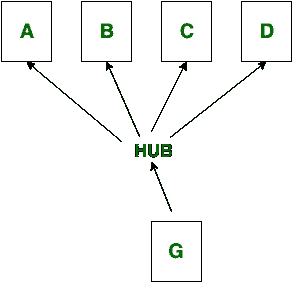
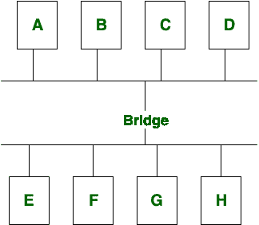

# 轮毂和桥梁的区别

> 原文:[https://www . geesforgeks . org/hub-and-bridge 之间的差异/](https://www.geeksforgeeks.org/difference-between-hub-and-bridge/)

先决条件–[网络设备](https://www.geeksforgeeks.org/network-devices-hub-repeater-bridge-switch-router-gateways/)
**集线器:**
集线器是一种网络设备，用于将信号传输到接收信号的每个端口(一个端口除外)以做出响应。集线器在物理层运行。在这种情况下，包过滤是不可用的。它有两种类型:主动集线器和被动集线器。

**网桥:**
网桥也是一种网络设备，用于连接使用相同协议的两个不同局域网。桥的类型有源路由、透明和转换。在网桥中，一个端口用于输入，另一个端口用于输出。

**枢纽和桥梁的区别:**

| S.NO | 中心 | 桥 |
| 1. | 集线器是用于连接多个设备的网络设备。 | 网桥也是一种网络设备，用于连接使用相同协议的两个不同局域网。 |
| 2. | 集线器的类型有:主动和被动。 | 桥的类型有:源路由、透明和翻译。 |
| 3. | Hub 不执行数据过滤。 | 而 bridge 执行数据过滤。 |
| 4. | 集线器中使用了多个端口。 | 但是在网桥中，一个端口用于输入，另一个端口用于输出。 |
| 5. | 集线器连接局域网的网段。 | 而网桥连接两个使用相同协议的不同局域网。 |
| 6. | 集线器运行在国际标准化组织现场视察模型的物理层上。 | 而网桥在 ISO-OSI 模型的数据链路层运行。 |