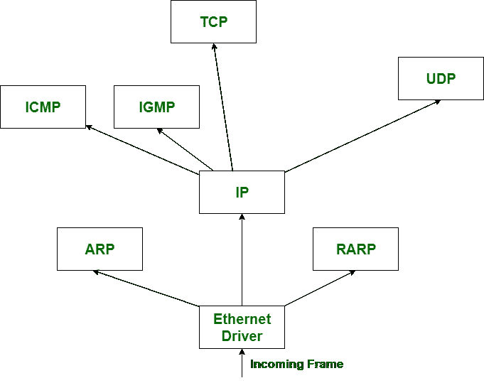

# 【ICMP 和 IGMP 的区别

> 原文:[https://www . geeksforgeeks . org/区别-icmp-和-igmp/](https://www.geeksforgeeks.org/difference-between-icmp-and-igmp/)

[ICMP](https://www.geeksforgeeks.org/internet-control-message-protocol-icmp/) 代表**互联网控制消息协议**， **IGMP** 代表**互联网组消息协议。**两者都是网络中最重要的东西或名词。

**ICMP(互联网控制消息协议)**用于预测网络或相关主机的可达性。此外，它还用于 PING 一个信息科学地址，以预测是否有属性。而 **IGMP(互联网组消息协议)**则用于客户端通过卫星关联观看电视时的集群数据包传输。

ICMP(互联网控制消息协议)和 IGMP(互联网组消息协议)之间的主要区别在于，IGMP 用于形成主机集群，而 ICMP 用于发送错误消息和主机指示的操作数据。

让我们看看 ICMP 和 IGMP 的区别:

| S.NO | 网间控制报文协议(Internet Control Messages Protocol) | IGMP |
| --- | --- | --- |
| 1. | ICMP 代表互联网控制消息协议。 | 而 IGMP 代表互联网组消息协议。 |
| 2. | ICMP 具有 **PING** 功能。 | 同时具有**组播**功能。 |
| 3. | 互联网控制消息协议正在单播。 | 而互联网组消息协议是多播。 |
| 4. | ICMP 可以在主机到主机或主机到路由器或路由器到路由器之间运行。 | 而 IGMP 可以用于客户端到组播路由器之间。 |
| 5. | ICMP 是第 3 层协议。 | IGMP 也是网络层或第 3 层协议。 |
| 6. | 它控制单播通信并用于报告错误。 | 它控制多播通信。 |
| 7. | ICMP 可能是主机和网关用来向发送方发回数据报下行通知的机制。 | 而 IGMP 被用来促进消息向一群接收者的同步传输。 |
| 8. | ICMP 用于测试主机或网络的可达性。 | 而 IGMP 用于分组传输，如数字地面系统服务。 |