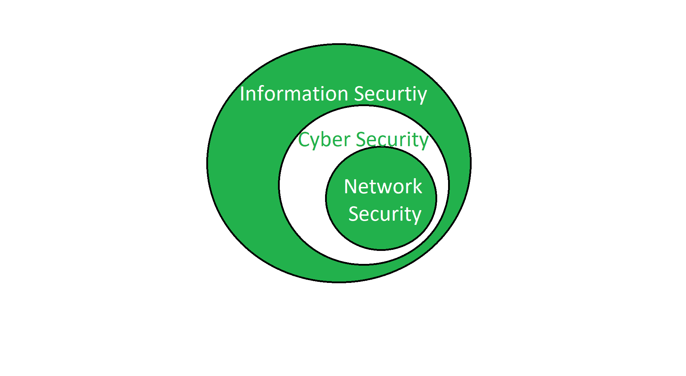

# 信息安全与网络安全的区别

> 原文:[https://www . geesforgeks . org/信息安全与网络安全的区别/](https://www.geeksforgeeks.org/difference-between-information-security-and-network-security/)

**[信息安全](https://www.geeksforgeeks.org/what-is-information-security/) :**
信息安全是为保护信息不被非法访问和使用而采取的措施。它提供机密性、完整性和可用性。它是包含网络安全和网络安全的超级集合。对于任何大规模工作的组织或公司来说，这都是必要的。

**[网络安全](https://www.geeksforgeeks.org/network-security/) :** 网络安全是任何企业或组织使用硬件和软件系统来保护其计算机网络和数据安全的措施。这旨在确保数据和网络的保密性和可访问性。每个处理大量数据的公司或组织都有一定程度的解决方案来应对许多网络威胁。

**信息安全与网络安全的区别:**

| 信息安全 | 网络安全性 |
| --- | --- |
| 它保护信息免受未经授权的用户、访问和数据修改。 | 它保护网络上流动的数据。 |
| 它是网络安全和网络安全的超级集合。 | 它是网络安全的一个子集。 |
| 信息安全是针对信息的，与领域无关。 | 它保护网络领域的任何东西。 |
| 它涉及保护数据免受任何形式的威胁。 | 它处理防御拒绝服务攻击。 |
| 它打击未经授权的访问，披露修改和破坏。 | 网络安全部门打击特洛伊木马。 |
| 它提供机密性、完整性和可用性。 | 它仅通过网络提供安全性。 |
| 信息安全确保保护传输和固定数据。 | 网络安全确保只保护传输数据。 |
| 它处理信息资产和完整性、保密性和可用性。 | 它保护终端通过网络传输的数据。 |

