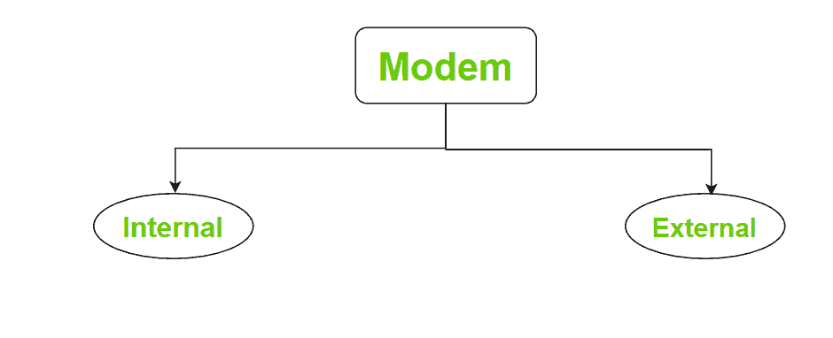

# 内部和外部调制解调器的区别

> 原文:[https://www . geesforgeks . org/内外调制解调器的区别/](https://www.geeksforgeeks.org/difference-between-internal-and-external-modem/)

**调制解调器:**
调制解调器是一种硬件联网设备，其基本功能是将数据转换为信号。调制解调器很重要，以便拥有互联网接入。调制解调器有两种类型:

**1。内部调制解调器:**
顾名思义，内部调制解调器是计算机内部的一个部件。它通常随电脑一起提供，而且也是预装的。内置调制解调器最好的一点是，它使用计算机的电源工作，不需要额外的电源。

**2。外部调制解调器:**
外部调制解调器与内部调制解调器相似，安静，因为它也允许访问互联网。外部调制解调器是计算机的外部部分。当计算机无法安装内置调制解调器时，可以使用它。调制解调器通常通过串行或通用串行总线电缆连接到计算机，并且它还需要外部电源来运行。

**内外调制解调器的区别:**

| 没有。 | 内部调制解调器 | 外部调制解调器 |
| 1. | 它有内置的 UART。 | 它没有内置 UART。他们使用计算机的串行端口作为通用异步收发器。 |
| 2. | 与外部调制解调器相比，其价格较低。 | 价格相对较高。 |
| 3. | 对于内置调制解调器，用户不需要购买任何外部附件。 | 在外部调制解调器中，必须带 RS232 接口电缆。 |
| 4. | 很难将内部调制解调器转移到另一台计算机。 | 外部调制解调器可以轻松移动。 |
| 5. | 内置调制解调器由电脑供电。 | 外部调制解调器需要外部电源。 |
| 6. | 它存在于计算机内部。 | 它存在于计算机之外。 |
| 7. | 它可以插入空闲的扩展槽。 | 它不能进入扩展槽。 |
| 8. | 不需要支架盒。 | 需要支架盒。 |
| 9. | 它与不同类型的电脑不兼容。 | 它兼容所有类型的电脑。 |
| 10. | 用户无法直接看到调制解调器的状态。 | 用户可以直接检查调制解调器的状态。 |

