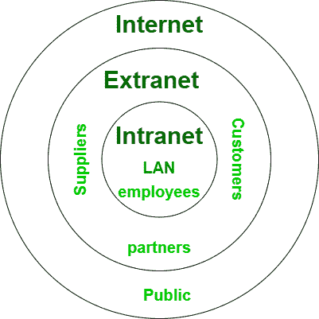

# 互联网和外网的区别

> 原文:[https://www . geesforgeks . org/互联网与外联网的区别/](https://www.geeksforgeeks.org/difference-between-internet-and-extranet/)

**1。互联网:**
互联网是公共网络，不归任何人所有。因为它是一个公共网络，所以任何人都可以在没有有效用户名和密码的情况下访问它。就连接设备的数量而言，互联网是最大的网络。其中，用户众多，为用户提供了大量的信息。它是一个在全世界分享信息的工具。

**2。外联网:**
外联网是一个专用网络，由一个或多个组织拥有。因为它是一个私有网络，所以没有有效的用户名和密码，任何人都不能访问它。它充当内部和外部成员之间共享信息的媒介。它是一个更安全的网络，由众多组织管理。

让我们看看互联网和外联网的区别:

<figure class="table">

| S.NO | 互联网 | 外联网 |
| --- | --- | --- |
| 1. | 它被用作公共网络。 | 而它被用作专用网络。 |
| 2. | 互联网不太安全，因为它在防火墙中没有安全级别。 | 而外联网比互联网更安全。 |
| 3. | 就互联网而言，任何人都可以在没有有效用户名和密码的情况下访问它。 | 而在外联网的情况下，没有有效的用户名和密码，任何人都不能访问它。 |
| 4. | 大量用户可以访问互联网。 | 而在这里，有限数量的用户可以访问外联网。 |
| 5. | 互联网是全世界共享信息的工具。 | 而它则充当内部和外部成员之间共享信息的媒介。 |
| 6. | 互联网不属于任何人。 | 而外联网由一个或多个组织拥有。 |
| 7. | 互联网不是由任何一个机构管理的。 | 与互联网不同，它由众多组织管理。 |
| 8. | 就连接设备的数量而言，互联网是最大的网络。 | 而在外联网的情况下，与互联网相比，它在连接设备方面很小。 |
| 9. | 互联网比外联网便宜。 | 而在外联网的情况下，成本更高。 |
| 10. | 它的用户是普通大众。 | 它的用户是组织中相互联系的员工。 |
| 11. | 它不属于任何人。 | 它由一个或多个组织拥有。 |
| 12. | 互联网没有监管机构。 | 它由多个组织管理。 |
| 13. | 由 ISP 维护。 | 它由组织的首席信息官、人力资源或沟通部门维护。 |
| 14. | 它是网络的网络。 | 它来源于内部网。 |
| 15. | 我们通常使用的是互联网。 | 例如:戴尔和英特尔使用网络进行业务相关操作。 |

</figure>