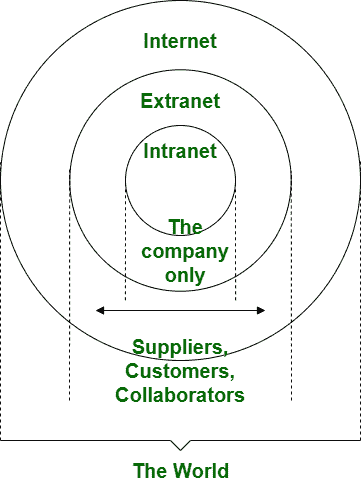

# 内网和外网的区别

> 原文:[https://www . geesforgeks . org/内联网和外联网的区别/](https://www.geeksforgeeks.org/difference-between-intranet-and-extranet/)

**1。内部网:**
内部网由一个组织拥有，是整个组织共享信息的工具。这是一种私人使用的互联网。因为内部网是一个私有网络，所以没有人可以使用没有有效用户名和密码的内部网。在内部网中，与互联网相比，连接的设备数量有限。内部网非常安全，访客数量很少。它用于获取员工信息、电话簿等。

**2。外联网:**
外联网由一个或多个组织拥有。它在组织间以合同为基础进行管理，是内部成员和外部成员之间共享信息的工具。像内联网一样，它也是一个专用网络，因此只有那些拥有有效用户名和密码的人才能使用外联网。外联网用于检查状态、访问数据、发送邮件、下订单等。

让我们看看下面给出的外联网和内联网的区别

<figure class="table">

| S.NO | 内部网络 | 外联网 |
| --- | --- | --- |
| 1. | 内部网是整个组织共享信息的工具。 | 而外联网是内部成员和外部成员之间共享信息的工具。 |
| 2. | 内部网归一个组织所有。 | 而外联网由一个或多个组织拥有。 |
| 3. | 在内部网中，安全性是通过防火墙实现的。 | 而在这种情况下，安全是通过防火墙实现的，以便将外联网和互联网分开。 |
| 4. | 内部网由一个组织管理。 | 而外联网由许多组织管理。 |
| 5. | 内部网连接的设备数量有限。 | 而在外联网中，连接的设备与内联网相当。 |
| 6. | 内部网是组织的专用网络类型。 | 同时，它也是一个专用网络，其中使用公共网络来向供应商和客户共享信息。 |
| 7. | 内部网用于获取员工信息、电话簿等。 | 而它用于检查状态、访问数据、发送邮件、下订单等。 |
| 8. | 内联网是外联网的受限和受损版本。 | 而外联网是互联网的受限和受损版本。 |
| 9. | 一个特定的组织是内部网的管理机构。 | 虽然它由多个组织管理。 |
| 10. | 它只对组织成员开放。 | 组织成员以及有登录名的外部成员都可以访问它。 |
| 11. | 这是一个组织的禁区。 | 它的限制区域取决于一个组织和它的一些利益相关者。 |
| 12. | 它来源于互联网。 | 它来源于内部网。 |
| 13. | 例子:WIPRO 利用内部网络进行商业运作。 | 例如:戴尔和英特尔使用网络进行业务相关操作。 |

</figure>