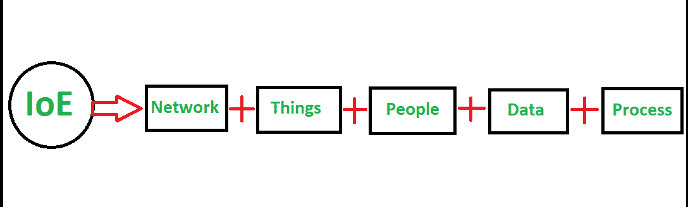
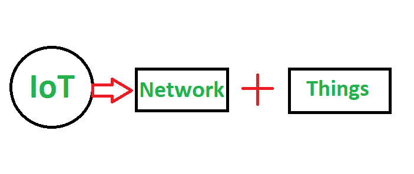

# IoE 与物联网的区别

> 原文:[https://www . geesforgeks . org/ioe 和 iot 之间的差异/](https://www.geeksforgeeks.org/difference-between-ioe-and-iot/)

**1。[万物互联(IoE)](https://www.geeksforgeeks.org/internet-of-everything/) :**
IoE 是人、流程、数据、物 4 大要素的智能连接。它被认为是物联网(IOT)的超集。IoE 涵盖了更广泛的连接概念，其中网络智能是物联网的基础。物联网是物联网的延伸。

**2。[物联网(IoT)](https://www.geeksforgeeks.org/introduction-to-internet-of-things-iot-set-1/) :**
物联网是通过无线网络收集和交换数据的互联物理设备/对象的网络。物联网有两个主要部分，即作为连接主干的“互联网”和对对象/物理设备有意义的“物”。它将互联网、数据处理、分析和决策的力量带到了物理对象的真实世界。

**IoE 与物联网的区别:**

| 序列号 | 万物互联(IoE) | 物联网 |
| --- | --- | --- |
| 1. | IoE 一词是由思科公司创造的。 | 物联网这个术语是凯文·阿什顿在 1999 年宝洁工作期间创造的。 |
| 2. | IoE 通过创造“物联网”即下一代互联网，将人、过程、数据和事物进行智能连接。 | 物联网是物理设备的网络，数据的收集和交换无需人工干预。 |
| 3. | IoE 的目标是将信息转化为行动，提供基于数据的决策，并提供新的能力和更丰富的体验。 | 物联网的目标是形成一个由互联对象/物理设备组成的生态系统。或者创造一个连接东西的生态系统。 |
| 4. | 在 IoE，交流发生在机器对机器、机器对人和技术辅助的人对人之间。 | 在物联网中，通信发生在机器之间。 |
| 5. | 它比物联网更复杂，因为 IoE 包括 IoD(数字互联网)、IoH(人类互联网)和物联网(物联网)。 | 它没有 IoE 复杂，因为物联网被认为是大 IoE 生态系统的一部分。 |
| 6. | 它有四大支柱人、流程、数据和事物。 | 它有一个支柱，即它只关注物理对象。 |
| 7. | 它被认为是物联网的超集，与 IoH、IoD、通信技术和互联网一起被认为是物联网之后的一代。 | 它被认为是更大的物联网(IoE)的子集，物联网被认为比 IoE 早一代。 |
| 8. | 例如，连接道路和医院以拯救更多生命，连接家庭以获得舒适的生活，连接食品和供应链中的人，老年护理监控。 | 例如可穿戴健康监测器、联网设备、自动农业设备、智能能源管理系统、智能监控。 |

