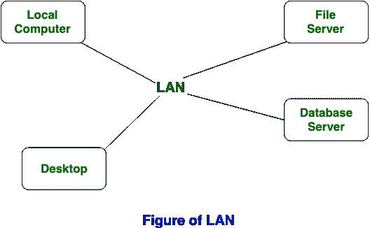
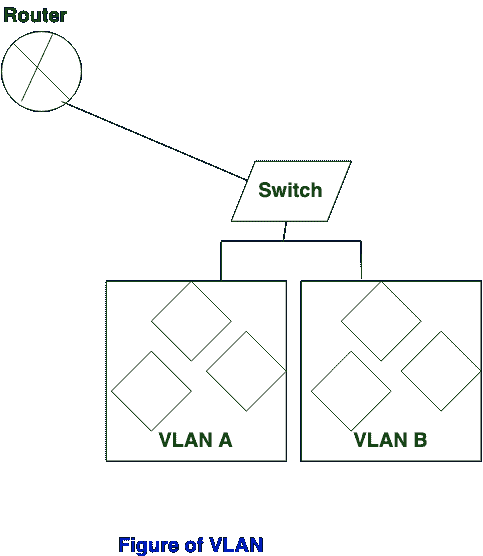

# 兰和 VLAN 的区别

> 原文:[https://www . geesforgeks . org/LAN 和 vlan 的区别/](https://www.geeksforgeeks.org/difference-between-lan-and-vlan/)

**局域网**代表**局域网**是一组允许连接设备之间通信的网络设备。另一方面 **VLAN** 代表[虚拟局域网](https://www.geeksforgeeks.org/virtual-lan-vlan/)，用于增强局域网的性能。

局域网(局域网)和 VLAN(虚拟局域网)的主要区别是局域网在单个广播域上工作，而 VLAN 在多个广播域上工作，在局域网中，数据包被通告给每个设备，而在虚拟局域网中，数据包被发送给特定的广播域。

**LAN 和 VLAN 的区别:**

| S.NO | 局域网 | 虚拟局域网 |
| 1. | 局域网代表局域网。 | VLAN 代表虚拟局域网。 |
| 2. | 局域网的成本很高。 | 虚拟局域网的成本更低。 |
| 3. | 局域网的延迟很高。 | 虚拟局域网的延迟很低。 |
| 4. | 局域网中使用的设备有:集线器、路由器和交换机。 | VLAN 使用的设备有:桥梁和开关。 |
| 5. | 在局域网中，数据包被通告给每台设备。 | 在虚拟局域网中，数据包被发送到特定的广播域。 |
| 6. | 局域网的效率不如虚拟局域网。 | 虚拟局域网比局域网更有效。 |