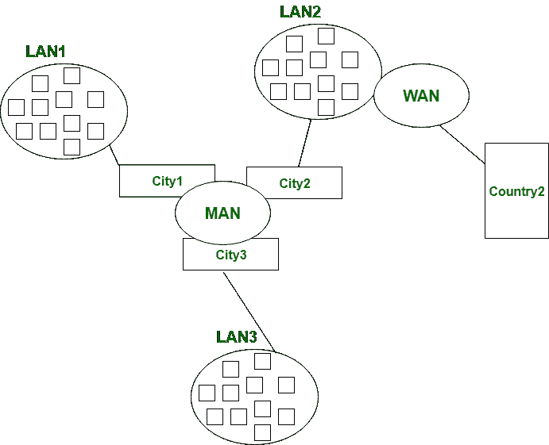

# 局域网、城域网和广域网的区别

> 原文:[https://www . geesforgeks . org/LAN-man-and-wan 的区别/](https://www.geeksforgeeks.org/difference-between-lan-man-and-wan/)

先决条件–[区域网络类型–局域网、城域网](https://www.geeksforgeeks.org/computer-network-types-area-networks-lan-man-wan/)、[和广域网](https://www.geeksforgeeks.org/computer-network-types-area-networks-lan-man-wan/)

**LAN** 代表局域网。它是一组网络设备，允许各种连接设备之间的通信。私有制控制着局域网，而不是公共网络。局域网比城域网和广域网具有更短的传播延迟。它涵盖了较小的领域，如大学、学校、医院等。

**MAN** 代表城域网。它比局域网覆盖的面积更大，比如小城镇、城市等。城域网连接两台或多台位于相同或完全不同城市的计算机。MAN 是昂贵的，应该或不应该由一个组织拥有。

**WAN** 代表广域网。它比局域网和城域网覆盖的面积更大，如国家/大陆等。广域网很贵，应该或不应该由一个组织拥有。PSTN 或卫星媒体用于广域网。

局域网、城域网和广域网的区别

### **局域网、城域网和广域网的区别**

<figure class="table">

| 基础 | 局域网 | 男人 | 广域网 |
| --- | --- | --- | --- |
| 完整形式 | 局域网代表局域网。 | 城域网代表城域网。 | 广域网代表广域网。 |
| 地理跨度 | 在同一个建筑或校园等小区域运营。 | 在城市等大区域运营。 | 在国家或大陆等更大的地区运营。 |
| 所有权 | 局域网的所有权是私有的。 | 人类的所有权可以是私有的，也可以是公有的。 | 而广域网也可能不属于一个组织。 |
| 传输速度 | 局域网的传输速度很快。 | 而城域网的传输速度一般。 | 而广域网的传输速度很低。 |
| 传播延迟 | 局域网中的传播延迟很短。 | 城域网中有适度的传播延迟。 | 然而，在广域网中有很长的传播延迟。 |
| 拥挤 | 局域网中拥塞较少。 | 而城域网则更加拥堵。 | 而广域网中的拥塞比城域网多。 |
| 设计和维护 | 局域网的设计和维护很容易。 | 而城域网的设计和维护比局域网困难。 | 而广域网的设计和维护也比局域网和城域网困难。 |
| 容错 | 局域网中有更多的容错能力。 | 而容错性较低。 | 在广域网中，容错性也较低。 |

</figure>