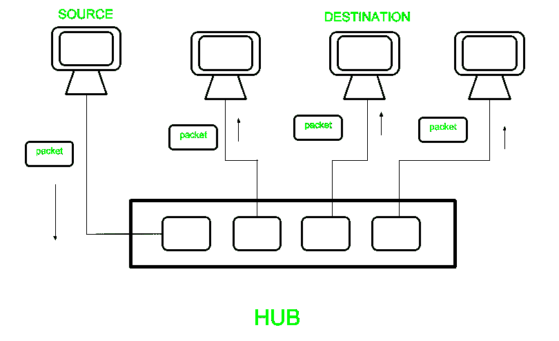
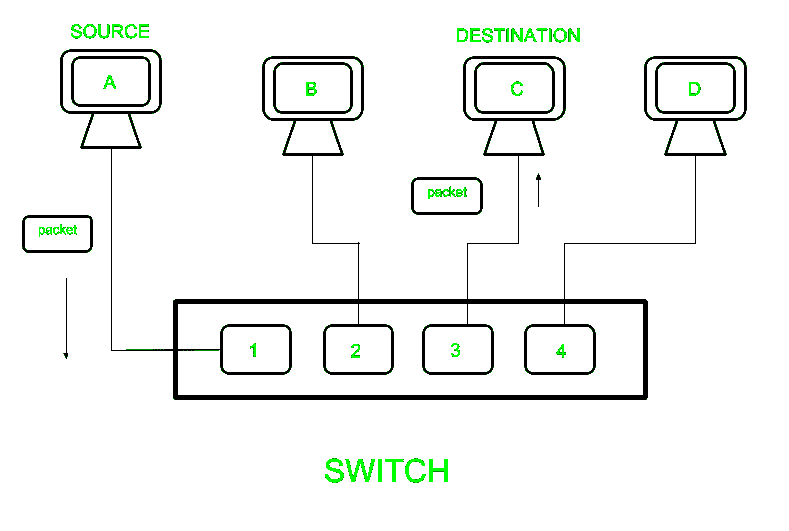
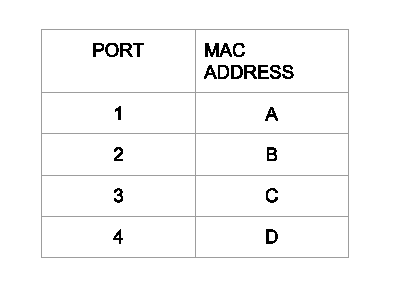

# 第二层和第三层交换机的区别

> 原文:[https://www . geesforgeks . org/第二层和第三层交换机之间的差异/](https://www.geeksforgeeks.org/difference-between-layer-2-and-layer-3-switches/)

先决条件–[网络设备](https://www.geeksforgeeks.org/network-devices-hub-repeater-bridge-switch-router-gateways/)
**交换机**是在本地网络中发送数据包的设备。比 hub 有什么优势？集线器向网络发送数据包，只有目的系统接收到该数据包，而其他系统只是丢弃，因此流量会大大增加。为了解决这个问题，开关出现了。交换机首先通过像集线器一样泛洪网络来填充媒体访问控制地址表，从而了解特定设备连接到哪个端口。获知后，它只向该特定主机发送数据包。

第 2 层交换机工作在 OSI 模型的第 2 层，即数据链路层，并使用存储与目的端口相关联的设备的 mac 地址的 MAC 地址表向该端口发送“帧”。第三层交换机工作在 OSI 模型的第三层，即网络层，它通过使用 IP 地址来路由数据包，在虚拟局域网中被广泛使用。

<figure class="table">

| 第 2 层交换机 | 第三层交换机 |
| --- | --- |
| 在现场视察模型的第 2 层(数据链路)上运行。 | 在现场视察模型的第 3 层(网络层)上运行。 |
| 根据媒体访问控制地址向目的地发送“帧”。 | 借助 IP 地址路由数据包 |
| 仅使用媒体访问控制地址 | 可以执行 2 层和 3 层交换机的功能 |
| 用于减少本地网络上的流量。 | 主要用于实现 VLAN(虚拟局域网) |
| 相当快，因为他们不看数据包的第 3 层部分。 | 在将数据包发送到目的地之前，需要时间检查数据包 |
| 它只有一个广播域 | 它有多个广播域。 |
| 只能在网络内通信。 | 可以在网络内部或外部进行通信。 |

</figure>