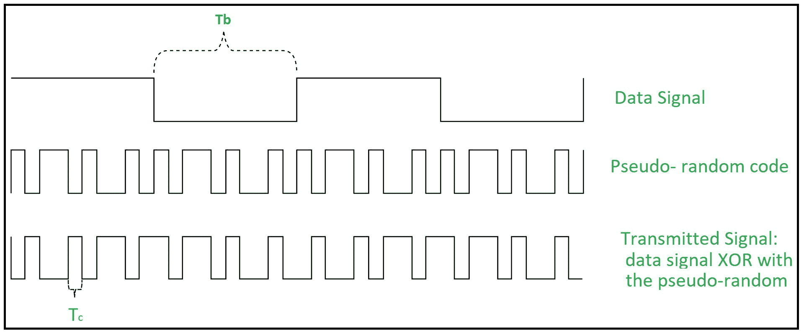
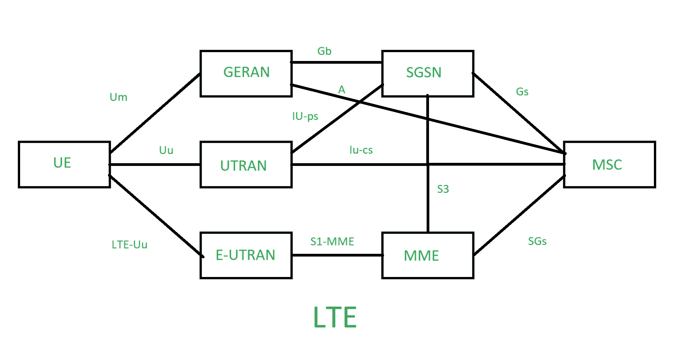

# LTE 和 CDMA 的区别

> 原文:[https://www . geeksforgeeks . org/LTE 和 cdma 的区别/](https://www.geeksforgeeks.org/difference-between-lte-and-cdma/)

**[码分多址(CDMA)](https://www.geeksforgeeks.org/multiple-access-protocols-in-computer-network/) :**
在 CDMA 中，一个信道同时承载所有传输。既没有带宽的划分，也没有时间的划分。例如，如果一个房间里有许多人同时在说话，那么如果只有两个人说同一种语言，也可以完美地接收数据。类似地，来自不同站点的数据可以用不同的代码语言同时传输。

**长期演进:**
**LTE 是为蜂窝移动通信系统开发高性能空中接口的项目名称。它用于推进一系列移动电信系统。这是一个高速数据网络。它是智能手机和移动设备最快的无线网络。**

****

**让我们看看长期演进和码分多址的区别:**

| 没有 | 长期演进 | 分码多重进接ˌ码分多址(Code Division Multiple Access) |
| --- | --- | --- |
| one | 它是用于高速接入的 4G 无线宽带技术。 | 它是 2G 和 3G 无线通信中使用的一组协议。 |
| Two | 它使用正交频分复用(OFDM)进行传输。 | 它使用扩频多址技术进行传输 |
| four | 它需要一个 SIM 卡来验证手机。 | It 移动手机不支持 SIM 卡。 |
| five | 它具有更好的多路信号处理能力。 | 它不擅长多路信号处理。 |
| six | 这是事实上的高速无线通信标准。 | 它是 2G 和 3G 无线通信中使用的一组协议。 |

