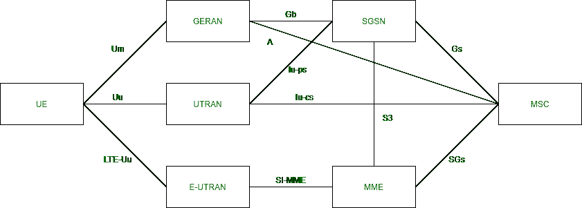
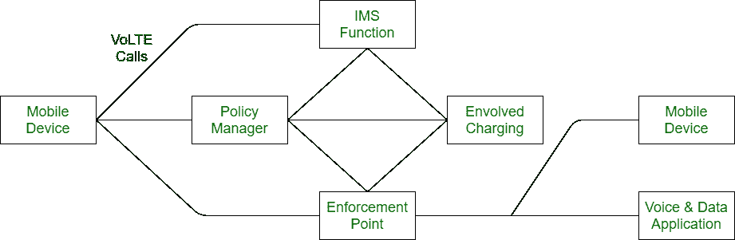

# LTE 和 VoLTE 的区别

> 原文:[https://www . geesforgeks . org/LTE 和 volte 之间的差异/](https://www.geeksforgeeks.org/difference-between-lte-and-volte/)

**1。长期演进(LTE) :**
LTE 是高速蜂窝数据通信系统的标准。它提供大约 100 Mbps 的下载速度和大约 50 Mbps 的上传速度。在使用数据服务时，它不能提供高质量的语音呼叫。

**2。长期演进语音系统(VoLTE) :**
VoLTE 是一个非常标准化的系统，用于进行高清语音通话。它允许用户在使用数据服务的同时进行语音呼叫，而不改变语音质量。

**LTE 和 VoLTE 的区别:**

| 长期演进 | 回 |
| --- | --- |
| 这是一个数据通信系统。 | 也是一种克服 LTE 的数据通信系统。 |
| 它可能同时支持也可能不支持数据和语音呼叫服务。 | 它总是同时支持数据和语音呼叫服务。 |
| 万一它同时支持数据和语音通话，语音通话的质量就不好了。 | 同时它支持高清质量的语音通话，同时使用数据服务。 |
| 拨打语音电话时，它会关闭数据连接。 | 进行语音通话时，它不会关闭数据连接。 |
| 两个用户之间的呼叫连接较慢(几乎需要 7 秒钟)。 | 如果两个用户都在 VoLTE 上，呼叫连接会更快。 |
| 视频通话需要 Skype 或 Whatsapp 等外部应用。 | 进行视频通话不需要外部应用程序。 |
| 它现在还没有被用户广泛使用。 | 它现在被更广泛地使用。 |

