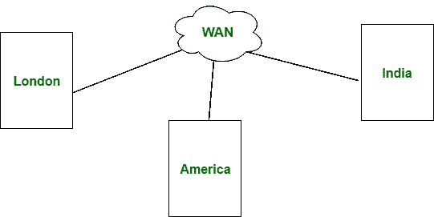

# 城域网和广域网的区别

> 原文:[https://www . geesforgeks . org/man-and-wan 的区别/](https://www.geeksforgeeks.org/difference-between-man-and-wan/)

先决条件–[区域网络类型–局域网、城域网和广域网](https://www.geeksforgeeks.org/computer-network-types-area-networks-lan-man-wan/)
**城域网(MAN):**
城域网覆盖面积比局域网大，如:小城镇、城市等。城域网连接 2 台或多台计算机，这些计算机以区域为单位分开，但位于相同或完全不同的城市。MAN 是昂贵的，应该或不应该由一个组织拥有。

**广域网:**
广域网比局域网和城域网覆盖的面积更大，如:国家/大陆等。广域网很贵，应该或不应该由一个组织拥有。PSTN 或卫星媒体用于广域网。

让我们看看城域网和广域网的区别:

| S.NO | 男人 | 广域网 |
| --- | --- | --- |
| 1. | 城域网代表城域网。 | 广域网代表广域网。 |
| 2. | 人可能不属于一个组织。 | 而广域网也可能不属于一个组织。 |
| 3. | 城域网有中等传播延迟。 | 而有很长的传播延迟。 |
| 4. | 城域网的传输速度比广域网快。 | 而广域网的传输速度较低。 |
| 5. | 城域网的设计和维护比局域网难。 | 而广域网的设计和维护也比局域网和城域网困难。 |
| 6. | 与广域网相比，城域网的噪声和误差更小。 | 而广域网比局域网和城域网有更多的噪声和错误。 |
| 7. | 城域网覆盖的面积比局域网大，但比广域网小。 | 而广域网比局域网和城域网占地面积更大。 |
| 8. | 城域网支持中等带宽的数据传输。 | 广域网支持低范围的带宽。 |
| 9. | 安装城域网的成本适中。 | 与局域网和城域网相比，安装成本非常高。 |