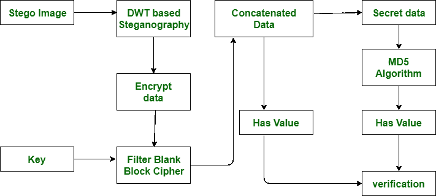

# MD5 和 SHA1 的区别

> 原文:[https://www . geesforgeks . org/MD5 和-sha1 之间的差异/](https://www.geeksforgeeks.org/difference-between-md5-and-sha1/)

先决条件–[SHA-1 哈希](https://www.geeksforgeeks.org/sha-1-hash-in-java/)、 [MD5 和 SHA1](https://www.geeksforgeeks.org/passwords-and-cryptographic-hash-function/)T4**MD5**都代表**消息摘要**和 **SHA1** 代表**安全哈希算法**在任何地方都要对哈希算法进行平方测量与 SHA1 的速度相比，MD5 的速度更快。

然而，SHA1 提供了比 MD5 更高的安全性。这些散列算法背后的构造是，这些平方度量通常生成知识或消息的新数字指纹，该指纹被理解为散列或摘要。

哈希算法的一些特性如下:

1.  这些功能是无法限制的。
2.  散列(或摘要)的大小通常是固定的，不依赖于信息的规模。
3.  第二个不同的信息集平方测度能够产生相同的散列。

让我们看看下面给出的 MD5 和 SHA1 之间的区别:

| S.NO | 讯息摘要 5 | SHA1 |
| --- | --- | --- |
| 1. | MD5 代表消息摘要。 | 而 SHA1 代表安全散列算法。 |
| 2. | MD5 可以有 128 位长度的消息摘要。 | 而 SHA1 可以有 160 位长度的消息摘要。 |
| 3. | 与 SHA1 的速度相比，MD5 的速度更快。 | 而 SHA1 的速度比 MD5 的速度慢。 |
| 4. | 为了弄清楚初始消息，攻击者想要 2^128 操作，而利用 MD5 算法程序。 | 另一方面，在 SHA1，是 2^160 让寻找变得相当麻烦。 |
| 5. | MD5 比 SHA1 简单。 | 而 SHA1 比 MD5 复杂。 |
| 6. | MD5 安全性较差。 | 同时它提供了平衡的或可容忍的安全性。 |
| 7. | 在 MD5 中，如果攻击者需要找出具有相同消息摘要的两条消息，那么攻击者将需要执行 2^64 操作。 | 而在 SHA1 中，攻击者需要执行大于 MD5 的 2^80 运算。 |
| 8. | MD5 是在 1992 年提出的。 | 而 SHA1 是在 1995 年提出的。 |