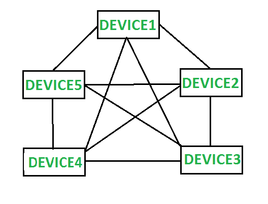
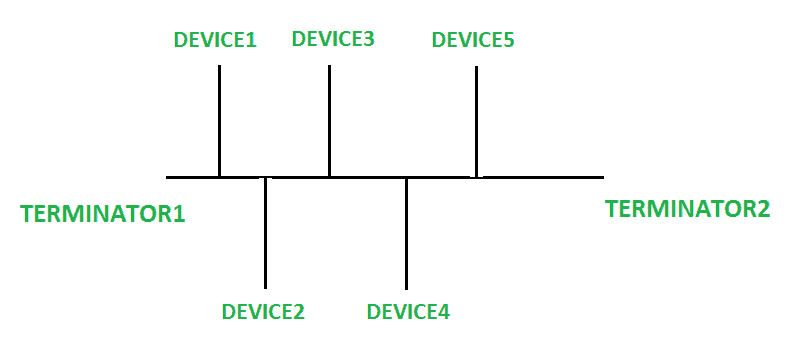

# 网状拓扑和总线拓扑的区别

> 原文:[https://www . geeksforgeeks . org/网状拓扑和总线拓扑的区别/](https://www.geeksforgeeks.org/difference-between-mesh-topology-and-bus-topology/)

先决条件–[网络拓扑类型](https://www.geeksforgeeks.org/types-of-network-topology/)

**1。网状拓扑:**
网状拓扑是一种网络拓扑，其中每台计算机都连接到网络中的每台其他计算机。它是最容错的网络拓扑，因为它有多个连接。在网状拓扑中，每台计算机都通过点对点链路连接到另一台计算机。如果有 n 个组件，则每个组件连接到 n-1 个其他组件，即具有 n 个组件的网状拓扑将具有 n(n-1)/2。网状拓扑可以有两种类型，即全网状拓扑和部分网状拓扑。网状拓扑是最健壮和可靠的拓扑之一。

**2。总线拓扑:**
总线拓扑是一种网络拓扑，其中所有设备都连接到一根电缆，该电缆被称为网络的主干。它由电缆两端的终端组成。网线负责设备之间的通信，当数据到达网线末端时，它会被终结器从数据线上移除。当设备以线性方式连接时，这是最简单的网络拓扑。

**网状拓扑和总线拓扑的区别:**

| 没有 | 网状拓扑 | 总线拓扑 |
| --- | --- | --- |
| 1. | 网状拓扑是指每台设备都连接到网络中其他每台设备的拓扑。 | 总线拓扑是一种拓扑，其中每个设备都连接到一根称为主干的电缆。 |
| 2. | 在网状拓扑中，一个设备的故障不会导致数据传输中断。 | 在总线拓扑中，网线的故障会导致整个网络出现故障。 |
| 3. | 网状拓扑可以管理网络中的大量流量，因为多个设备可以传输数据。 | 总线拓扑不能有效地管理大量的流量，就好像有大量的流量，那么网络的性能就会受到影响。 |
| 4. | 网状拓扑比总线拓扑更昂贵。 | 与网状拓扑相比，总线拓扑的成本更低。 |
| 5. | 与总线拓扑相比，网状拓扑更难理解。 | 总线拓扑相对更容易理解。 |
| 6. | 网状拓扑比总线拓扑传输数据更快。 | 与网状拓扑相比，总线拓扑中的数据传输速度较慢。 |
| 7. | 网状拓扑比总线拓扑提供更多的安全性。 | 与网状拓扑相比，总线拓扑提供的安全性较低。 |